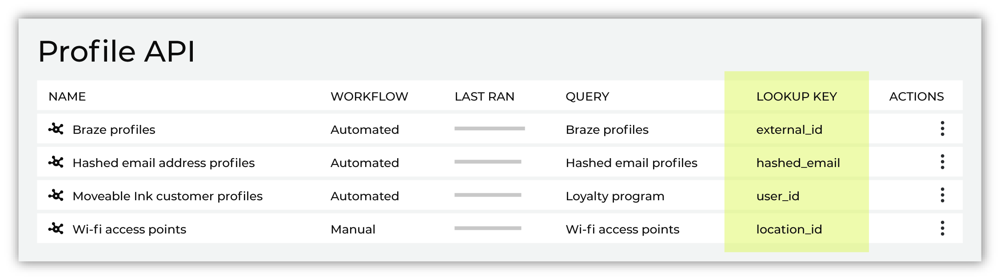
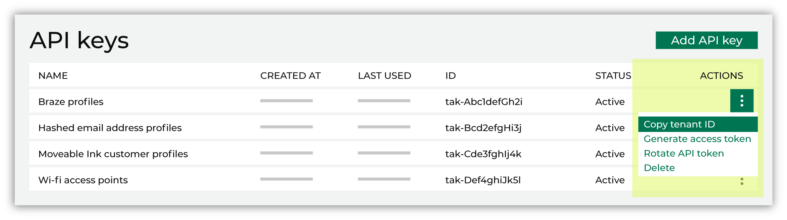

.. https://docs.amperity.com/operator/

.. meta::
    :description lang=en:
        This topic describes how the Profile API works.

.. meta::
    :content class=swiftype name=body data-type=text:
        This topic describes how the Profile API works.

.. meta::
    :content class=swiftype name=title data-type=string:
        Profile API

==================================================
Profile API
==================================================

.. important:: The Profile API documented on this page (right now) will be deprecated in favor of new Profile API endpoints: `GET Profile <../api/endpoint_get_profile.html>`__ and `GET Profiles list <../api/endpoint_get_profiles_list.html>`__. The use cases in this topic are true, but should be built using the new endpoints.

The Profile API is a RESTful API that supports building custom endpoints against unified customer profiles to enable any downstream workflow.

.. api-profile-about-start

The Profile API is unique to your tenant. The endpoints that are enabled for your use cases do not exist until you build them.

.. api-profile-about-start

.. api-profile-learning-lab-start

.. admonition:: Amperity Learning Lab

   The Profile API enables your brand to build a collection of RESTful API endpoints that are uniquely specific to your brand's use cases.

   For example, identify returning customers, customize welcome messages, personalize emails, or extend the profiles your brand uses for campaigns in Braze, Criteo, or Salesforce Marketing Cloud.

   Open **Learning Lab** to learn more about how your brand can use the `Profile API <https://learn.amperity.com/profile-api>`__ |ext_link|. Registration is required.

.. api-profile-learning-lab-end

.. _profile-api-howitworks:

How the Profile API works
==================================================

.. profile-api-howitworks-start

Each endpoint is defined by a query that you build in the **Queries** page, after which it may be generated as an index within the Profile API. A query defines an index, which is set of fields that exists within your unified customer profiles. A unique identifier acts as the lookup key to that index for the downstream workflow.

You can build as many endpoints as your downstream workflows require. Each individual endpoint can represent any section of your unified customer profiles:

* Loyalty programs
* Profiles built from hashed email addresses to support personalization for omnichannel customers
* Extended profile attributes for use with downstream systems, such as Braze, Cordial, and Salesforce Marketing Cloud
* Most recent purchases, favorite products, or other aspects of your product catalog
* Personalization for websites, product suggestions, etc.

Any set of results that you can return with a query in Amperity can be enabled for use as an endpoint for your tenant's Profile API. Use any unique identifier in your unified customer profiles as the lookup key, use that lookup key to access individual attributes located at that endpoint, and then the on-demand access to your unified customer profiles to light up your use cases.

.. tip:: :ref:`Use more (smaller) indexes instead of fewer (larger) indexes! <profile-api-response-times>` Build each endpoint to be as specific to your downstream use case requirements as you need it to be.

.. profile-api-howitworks-end

.. _profile-api-howitworks-endpoints:

Profile API endpoints
--------------------------------------------------

.. profile-api-howitworks-endpoints-start

The Profile API has the following endpoints:

* :ref:`GET indexes <profile-api-howitworks-endpoints-get-indexes>`
* :ref:`GET indexes/{index-id} <profile-api-howitworks-endpoints-get-index>`
* :ref:`Profile API responses <profile-api-howitworks-endpoints-responses>`

.. profile-api-howitworks-endpoints-end

.. profile-api-howitworks-endpoints-which-policies-start

.. admonition:: What policies users need?

   The Profile API requires the following policies to be assigned to users within your tenant:

   #. **Allow Profile API administration** This policy allows users to use the **Destinations** page to manage endpoints in your tenant's Profile API.
   #. **Allow API key administration** This policy allows users to use the **Users and Activity** page to manage API keys and tokens required by Amperity APIs.

   These policies may be assigned to the same user.

.. profile-api-howitworks-endpoints-which-policies-end

.. _profile-api-howitworks-endpoints-get-indexes:

GET indexes
++++++++++++++++++++++++++++++++++++++++++++++++++

.. profile-api-howitworks-endpoints-get-indexes-start

Use the **indexes** endpoint to get a list of indexes that exist in your tenant's Profile API.

The URL for this endpoint is:

::

   https://{tenant-domain}/attribute/v0/indexes

.. tip:: You can copy the full URL from the **Destinations** page (under **Profile API**, from the |fa-kebab| menu for an endpoint, select **Copy URL**), and then use the copied URL in the request.

   .. image:: ../../images/api-profile-endpoint-copy-url.png
      :width: 500 px
      :alt: Copy the URL for an endpoint in the Amperity Profile API.
      :align: left
      :class: no-scaled-link

   The copied URL contains the correct value for the selected endpoint's **{tenant-domain}**; change the **{index-id}** to "indexes".

**cURL example**

::

   curl -H "X-AMPERITY-TENANT: {tenant-id}" \
        -H "Authorization: Bearer ${access-token}" \
        -H "Content-Type: application/json" \
        'https://{tenant-domain}/attribute/v0/indexes'

where

* **{tenant-id}** is the name of your tenant
* **{access-token}** is the access token
* **{tenant-domain}** is the domain name for your tenant

.. note:: The URL should not have a trailing slash.

**Response**

The response returns a list of endpoints (indexes) that are available within your tenant's Profile API. For example, a list of three indexes (Braze User Profiles, Product Catalog, and Hashed Email Profiles) have a response similar to:

.. code-block:: salt
   :linenos:

   {"indexes":
     [
       {"id":"ix-aBCdeFgh",
         "name":"Braze User Profiles",
         "field":"external_id",
         "build": {
           "created_at":"2023-05-31T08:15:00.000Z",
           "updated_at":"2023-05-31T08:15:00.000Z",
           "build_id":"idb-ABc12dE3FG4"
         }
       },
       {"id":"ix-1AbcD234E",
         "name":"Product Catalog",
         "field":"product_id",
         "build": {
           "created_at":"2023-05-31T09:30:00.000Z",
           "updated_at":"2023-06-01T09:30:00.000Z",
           "build_id":"idb-12abcD3EFG4"
         }
       },
       {"id":"ix-01AbcdE23",
         "name":"Hashed Email Profiles",
         "field":"hashed_email",
         "build": {
           "created_at":"2023-05-31T10:45:00.000Z",
           "updated_at":"2023-06-01T10:45:00.000Z",
           "build_id":"idb-acbdEFGHIj1"
         }
       }
     ]
   }

.. profile-api-howitworks-endpoints-get-indexes-end

.. _profile-api-howitworks-endpoints-get-index:

GET indexes/{index-id}
++++++++++++++++++++++++++++++++++++++++++++++++++

.. profile-api-howitworks-endpoints-get-index-start

Use the **indexes/{index-id}** endpoint to use the lookup key for **{index-id}** to access individual attributes associated with that lookup key.

The URL for this endpoint is:

::

   https://{tenant-domain}/attribute/v0/indexes/{index-id}

where **{index-id}** :ref:`matches the index ID <profile-api-howitworks-index-ids>` that is configured for that endpoint in Amperity. Individual attributes are available from **{index-id}** by using the lookup key for that index to return specific named attributes.

.. tip:: You can copy the full URL from the **Destinations** page (under **Profile API**, from the |fa-kebab| menu for an endpoint, select **Copy URL**), and then use the copied URL in the request.

   .. image:: ../../images/api-profile-endpoint-copy-url.png
      :width: 500 px
      :alt: Copy the URL for an endpoint in the Amperity Profile API.
      :align: left
      :class: no-scaled-link

   The copied URL contains the correct values for the selected endpoint's **{tenant-domain}** and **{index-id}**. Append the lookup key using **?key={key-value}** to the copied URL to return a single unique record *or* a list of attributes associated with that row.

**cURL example for a single unique record**

::

   curl -H "X-AMPERITY-TENANT: {tenant-id}" \
        -H "Authorization: Bearer ${access-token}" \
        -H "Content-Type: application/json" \
        'https://{tenant-domain}/attribute/v0/indexes/{index-id}\
        ?key={key-value}'

where

* **{tenant-id}** is the name of your tenant
* **{access-token}** is the access token
* **{tenant-domain}** is the domain name for your tenant
* **{index-id}** is the index ID for the endpoint
* **{key-value}** is the lookup key for the request

  If an attribute is not unique for the specified lookup key value, a value will be returned, but it may not be the value you were expecting.

.. note:: The URL should not have a trailing slash.

**cURL example for multiple matching records**

::

   curl -H "X-AMPERITY-TENANT: {tenant-id}" \
        -H "Authorization: Bearer ${access-token}" \
        -H "Content-Type: application/json" \
        'https://{tenant-domain}/attribute/v0/indexes/{index-id}\
        ?key={key-value}\
        &all_matches=true'

where all of the parameters are the same as the example request for a single unique record *with the addition of the* **all_matches=true** paramater, which returns all matching records :ref:`up to the configured limit for this endpoint <profile-api-enable-add-index>`. Each returned record contains its own list of attributes.

**Responses**

The structure of the response depends on the attributes that are available within the index. The body of the response is similar to:

.. code-block:: salt
   :linenos:

   {"attributes"
     {"value" {"attribute": "value"}, "lookup-key" "lookup-key-value"},
     "metadata" {
       "build-id" "build-id-value",
       "index-id" "index-id-value"}
   }

For example, an index that uses "loyalty_id" as the lookup key, and returns "firstname", "lastname" for loyalty ID "a-01234-b" for a customer named "Dennis Terrell" have a response similar to:

.. code-block:: salt
   :linenos:

   {
     "attributes": {
       "value": {
         "loyalty_id": "a-01234-b",
         "firstname": "Dennis",
         "lastname": "Terrell"
       },
       "key": "a-01234-b"
     },
     "metadata": {
       "build-id": "idb-1ABcD2EFGhI",
       "index-id": "ix-aBCdeFgh"
     }
   }

An index that returns multiple matching records have a response similar to:

.. code-block:: salt
   :linenos:

   {
     "attributes": {
       "value": [
         { 
           "loyalty_id": "a-01234-b",
           "lastname": "Warren",
           "firstname": "Steven"
         },
         {
           "loyalty_id": "c-56789-d",
           "lastname": "Warren",
           "firstname": "Josh"
         }
       ],
       "key": "Warren"
     },
     "metadata": {
       "build-id": "idb-1ABcD2EFGhI",
       "index-id": "ix-aBCdeFgh"
     }
   }

.. profile-api-howitworks-endpoints-get-index-end

.. _profile-api-howitworks-endpoints-responses:

Profile API responses
++++++++++++++++++++++++++++++++++++++++++++++++++

.. profile-api-howitworks-endpoints-responses-start

The Profile API returns the following HTTP status codes:

**HTTP status codes**

.. list-table::
   :widths: 20 80
   :header-rows: 1

   * - Status code
     - Description
   * - **200 OK**
     - The requested values for the specified lookup key were returned successfully.

   * - **401 Unauthorized**
     - Verify the access token, index ID, and {tenant-id} used to make the request.

   * - **403 Forbidden**
     - Verify that the API key has access to the Profile API endpoint.

   * - **404 Not Found**
     - The requested value was not found. For example:

       * 404: No value found for key: "key-value".
       * 404: No build found for index-id: "index-id".
       * 404: No node found for build-id: "build-id".

       .. note:: A 404 Not Found status code will be returned when the URL contains a trailing slash.

   * - **503 Service Unavailable**
     - A generic error has occurred. The service may be unavailable. Verify the configuration of the request and the expected response values and try again.

.. profile-api-howitworks-endpoints-responses-end

.. _profile-api-howitworks-queries:

Queries
--------------------------------------------------

.. profile-api-howitworks-queries-start

A query defines the list of attributes that will be available from a Profile API endpoint, along with providing the lookup key that requests uses to return attribute values for the specified lookup key. Use the **Queries** page to build the query. Group all of the queries that support your tenant's Profile API use cases into the same folder.

.. tip:: All attribute names within a query that is used to build an endpoint for the Profile API should be unique to ensure that all attributes are unique by lookup key value in the index.

There are two requirements for queries that are used to define Profile API endpoints:

#. One field must be usable as the lookup key for the index. The value for this field must be a unique identifier. For example, the Amperity ID, a loyalty ID, a customer ID, a unique identifier in a downstream workflow (such as the "external_id" used in Braze), a non-hashed email address, a hashed email address, and so on.

   Use the unique identifier that works best for your use case. Each endpoint may specify its own lookup key. For example, for website personalization you might use a customer ID or a loyalty ID, but when building your marketing campaigns in Braze that bring your customers to that website, you could use the Braze "external_id" for the index.

#. There must be at least one attribute in that query that can be returned by the request to the endpoint for the specified lookup key. There is no practical limit to the number of attributes that can be in the index, but it is recommended to keep the list of attributes specific to your use case.

   Plan to use a variety of indexes to support a variety of use cases instead of using a single, large index. Some indexes, with the right combination of attributes, may be used to support multiple workflows.

.. profile-api-howitworks-queries-end

.. _profile-api-howitworks-lookup-keys:

Lookup keys
--------------------------------------------------

.. profile-api-howitworks-lookup-keys-start

The lookup key for an index is the primary key for that index. The field in the index that acts as the lookup key must be a field that provides a unique identifier, such as the Amperity ID, a loyalty program ID, an ID that is unique in the downstream location from which the Profile API is used to enable use cases, or some other identifier that allows a request to return a series of attributes that are associated with that unique identifier.

Each endpoint must have a lookup key. You can find the lookup key for any endpoint from the **Lookup Key** column in the **Profile API** list:

.. important:: The lookup key in the request must have an exact match within the index.

   For example: "Dennis" must match with an uppercase "D" and "Dennis " must match with both an uppercase "D" *and* a trailing character.

   Because each endpoint is defined using SQL within the **Query Editor**, the point at which you will define the consistency for how your downstream use case will access that data is from within the **Query Editor**.

   This should be done *before* making that query available to the Profile API.

   Formatting requirements are often determined by how the downstream use case will access the Profile API endpoint. These requirements include the tools that you uses to access the Profile API and also the individuals within your organization who need to understand how that information should be accessed.

.. profile-api-howitworks-lookup-keys-end

.. _profile-api-howitworks-index-ids:

Index IDs
--------------------------------------------------

.. profile-api-howitworks-index-ids-start

The index ID is a unique identifier for an endpoint. To make a request to an endpoint you must include the index ID in the URL for the request.

The index ID is available from the **Profile API** list. For the endpoint, open the actions menu, and then select "Copy index ID".

To make a request to a specific index, add the index ID to the end of the request URL:

::

   https://{tenant-domain}/attribute/v0/indexes/{index-id}

and then use the lookup key in your workflow to return individual attribute values in that index.

.. profile-api-howitworks-index-ids-end

.. profile-api-howitworks-index-ids-tip-start

.. tip:: You can copy the full URL from the **Destinations** page (under **Profile API**, from the |fa-kebab| menu for an endpoint, select **Copy URL**), and then use the copied URL in the request.

   .. image:: ../../images/api-profile-endpoint-copy-url.png
      :width: 500 px
      :alt: Copy the URL for an endpoint in the Amperity Profile API.
      :align: left
      :class: no-scaled-link

   The copied URL contains the correct values for the selected endpoint's **{tenant-domain}** and **{index-id}**.

.. profile-api-howitworks-index-ids-tip-end

.. _profile-api-howitworks-access-tokens:

Access token
--------------------------------------------------

.. profile-api-enable-api-jwt-start

Amperity uses a `JSON Web Token (JWT) <https://jwt.io/>`__ |ext_link| for authentication to the Profile API. A single access token may be used to access any endpoint in your tenant's Profile API.

The access token is self-generated from the Amperity user interface and authorizes requests to all endpoints in the Profile API for your tenant. A self-generated access token ensures that only your team has access to the token and supports organizational security policies like periodic access token rotation.

The access token must be available to each request made to the Profile API.

.. TODO: Add here some info about the self-serve token once it's in the UI. The image steps step-by-step.

.. profile-api-enable-api-jwt-end

.. _profile-api-howitworks-tenant-id:

Tenant ID
--------------------------------------------------

.. profile-api-howitworks-tenant-id-start

The tenant ID is a unique identifier for your tenant. To make a request to an endpoint you must include the tenant ID in the URL for the request.

The tenant ID is available from the **Profile API** list. For the endpoint, open the actions menu, and then select "Copy tenant ID".

.. profile-api-howitworks-tenant-id-end

.. _profile-api-rate-limit:

Rate limit
==================================================

.. profile-api-rate-limit-start

The Profile API does not currently enforce a rate limit. A rate limit is introduced at a point in the near future.

.. profile-api-rate-limit-end

.. _profile-api-enable:

Configure the Profile API
==================================================

.. profile-api-enable-api-start

The Profile API must be configured for use in Amperity. This is done in a series of steps:

#. :ref:`profile-api-enable-request`
#. :ref:`profile-api-enable-build-query`
#. :ref:`profile-api-enable-add-api-key`
#. :ref:`profile-api-enable-generate-access-token`
#. :ref:`profile-api-enable-add-index`
#. :ref:`profile-api-enable-generate-endpoint`
#. :ref:`profile-api-enable-copy-tenant-id`
#. :ref:`profile-api-enable-validate-endpoint`
#. :ref:`profile-api-enable-build-usecase`
#. :ref:`profile-api-enable-run-as-workflow`

.. profile-api-enable-api-end

.. profile-api-enable-api-note-start

.. note:: For endpoints that are running in your production environment that are actively being used with workflows, you should be careful about making changes to the list of attributes that are available in the index and to the values that are contained within those attributes. There are two approaches you could take:

   #. Use a sandbox to make changes directly to the "production" index, but run it from the sandbox to validate the changes and the effects those changes may have on the downstream workflow. This approach allows you to keep the same index ID in place and helps prevent disruption to any live Profile API integrations.

   #. Build a new index that contains the changes, and then test those changes incrementally downstream on individual locations within the workflow. This requires updating the index ID in the downstream workflow.

.. profile-api-enable-api-note-end

.. _profile-api-enable-request:

Request to enable
--------------------------------------------------

.. profile-api-enable-request-start

To enable the Profile API for your tenant:

.. list-table::
   :widths: 10 90
   :header-rows: 0

   * - .. image:: ../../images/steps-01.png
          :width: 60 px
          :alt: Step 1.
          :align: left
          :class: no-scaled-link
     - Contact your support representative via the `Amperity Support Portal <../support/index.html>`__ (or send email to support@amperity.com) and request enabling the Profile API for your tenant.

       Support will enable the Profile API on your tenant and will let you know when the process is completed.

       .. important:: Your support representative uses SnapPass to provide the temporary access token for the Profile API. (Amperity is building an interface that will allow you to self-generate the access token for the Profile API. This will ensure that only your team has access to the tokens and will make it easier to follow your organization's security policies, such as periodically refreshing the access tokens.)

   * - .. image:: ../../images/steps-02.png
          :width: 60 px
          :alt: Step 2.
          :align: left
          :class: no-scaled-link
     - After the Profile API is enabled, the Destinations page is updated to show the list of endpoints available to the Profile API:

       .. image:: ../../images/api-profile-destinations-list-empty.png
          :width: 500 px
          :alt: A list of endpoints for the Amperity Profile API.
          :align: left
          :class: no-scaled-link

.. profile-api-enable-request-end

.. _profile-api-enable-build-query:

Build a query
--------------------------------------------------

.. profile-api-enable-build-query-start

Build a query that contains the attributes you need to enable your downstream workflows. You can use any aspect of your unified customer profiles to light up these workflows. Consider your goals for each workflow, build a query that returns the list of attributes and lookup key that enables that workflow.

.. TODO: This admonition is the paragraph as the intro for the use cases section. Is fine for now.

.. important:: The Profile API can support an unlimited number of potential use cases. All you need to do is imagine the use case, identify the requirements for building that use case for your downstream workflow, and then build a query in Amperity that can be used to generate an index that contains the attributes you need to light up that use case.

.. profile-api-enable-build-query-end

.. _profile-api-enable-add-api-key:

Add API key
--------------------------------------------------

.. include:: ../../amperity_reference/source/api.rst
   :start-after: .. api-keys-api-token-add-profile-start
   :end-before: .. api-keys-api-token-add-profile-end

.. _profile-api-enable-generate-access-token:

Generate an access token
--------------------------------------------------

.. include:: ../../amperity_reference/source/api.rst
   :start-after: .. api-keys-access-tokens-generate-start
   :end-before: .. api-keys-access-tokens-generate-end

.. _profile-api-enable-add-index:

Add an index
--------------------------------------------------

.. api-profile-add-index-start

An index must be defined for each query that is used to generate an endpoint for the Profile API.

.. api-profile-add-index-end

**To add an index for the Profile API**

.. api-profile-add-index-steps-start

.. list-table::
   :widths: 10 90
   :header-rows: 0

   * - .. image:: ../../images/steps-01.png
          :width: 60 px
          :alt: Step 1.
          :align: left
          :class: no-scaled-link
     - Open the **Destinations** page and click the **Add Index** button. This button is located to the right of the **Profile API** section header.

       This opens the **Add Index** dialog box.

       .. image:: ../../images/api-profile-add-index-dialog-name.png
          :width: 500 px
          :alt: Add an index to the Profile API.
          :align: left
          :class: no-scaled-link

       Give the endpoint a name that clearly describes how it is used by downstream workflows. The name of an index must be unique and may not contain any of the following characters: ``\``, ``/``, ``:``, ``"``, ``*``, ``?``, ``<``, ``>``, or ``|``.

       Use a description to help other users in your tenant know what use cases this endpoint enables.

       .. note:: The name of the index is informational only. Endpoints are listed alphabetically by name; endpoint names are not used within requests.

   * - .. image:: ../../images/steps-02.png
          :width: 60 px
          :alt: Step 2.
          :align: left
          :class: no-scaled-link
     - Select the query that is used to generate the fields in the index, and then choose the field in that index that is used as the lookup key.

       .. image:: ../../images/api-profile-add-index-dialog-query-lookup.png
          :width: 500 px
          :alt: Select the query from which the index is built, and then set the lookup key.
          :align: left
          :class: no-scaled-link

   * - .. image:: ../../images/steps-03.png
          :width: 60 px
          :alt: Step 3.
          :align: left
          :class: no-scaled-link
     - Select the type of response this endpoint will provide.

       **A single unique record**

       Select the **Unique record** option to configure this endpoint to return only a single unique record.

       .. image:: ../../images/api-profile-add-index-dialog-response-unique.png
          :width: 500 px
          :alt: Configure an endpoint to respond with unique records.
          :align: left
          :class: no-scaled-link

       **A list of up to 10 matching records**

       Select the **List of matching records** option to configure this endpoint to return a list of up to 10 matching records.

       .. image:: ../../images/api-profile-add-index-dialog-response-many.png
          :width: 500 px
          :alt: Configure an endpoint to respond with unique records.
          :align: left
          :class: no-scaled-link

       Use the dropdown lists to define the field that determines sort order, and then choose a direction (ascending or descending). The field that determines sort order may be the same field that is used as the lookup key.

       Use the **LIMIT** setting to define the maximum number of matching records that may be in the list. This value must be at least 1 and cannot be more than 10.

   * - .. image:: ../../images/steps-03.png
          :width: 60 px
          :alt: Step 4.
          :align: left
          :class: no-scaled-link
     - Choose the method by which the index will be generated (over time). There are two options: after a courier group run or manually.

       Choose **None** when setting up an index for the first time or for an index that requires asynchronous or infrequent regeneration.

       .. image:: ../../images/api-profile-add-index-dialog-schedule-none.png
          :width: 500 px
          :alt: Configure an endpoint to regenerate manually.
          :align: left
          :class: no-scaled-link

       .. tip:: After you have tested and validated downstream use cases for the index and have identified the frequency at which the index requires regeneration, you may switch from manual to running the index after the specified courier group has completed. The index will be regenerated at same frequency as the courier group run. For example: daily, weekly, or monthly.

          .. image:: ../../images/api-profile-add-index-dialog-schedule-after-courier-group.png
             :width: 500 px
             :alt: Configure an endpoint to regenerate after a courier group run.
             :align: left
             :class: no-scaled-link

   * - .. image:: ../../images/steps-04.png
          :width: 60 px
          :alt: Step 5.
          :align: left
          :class: no-scaled-link
     - Save the index.

       If this save is for an initial test of the endpoint and contains only a small number of rows of data, the amount of time it can take to generate the index is measured in minutes. Use the **LIMIT** clause in the query to control the size of the index.

       .. note:: A very large index that is generated for the first time can take a while (up to 6 hours). Please allow the index to finish generating before trying to access it from a downstream workflow.

.. api-profile-add-index-steps-end

.. _profile-api-enable-generate-endpoint:

Generate the endpoint
--------------------------------------------------

.. profile-api-enable-generate-endpoint-start

An index must be generated before the endpoint will be available to your tenant's Profile API.

.. note:: The user interface for the Profile API shows a spinner icon (|notification-running|) when an index is being refreshed.

**To generate an index for a Profile API endpoint**

.. list-table::
   :widths: 10 90
   :header-rows: 0

   * - .. image:: ../../images/steps-01.png
          :width: 60 px
          :alt: Step 1.
          :align: left
          :class: no-scaled-link
     - Manually. Open the **Actions** menu for the index, and then select **Run**.

       .. image:: ../../images/api-profile-destinations-list-run.png
          :width: 500 px
          :alt: Run the index manually.
          :align: left
          :class: no-scaled-link

       **Run** does one of the following actions:

       #. Generates the index if it was not generated on save.
       #. Regenerates the index and refreshes the data that is available at that endpoint.

   * - .. image:: ../../images/steps-02.png
          :width: 60 px
          :alt: Step 2.
          :align: left
          :class: no-scaled-link
     - After a courier group completes.

       .. image:: ../../images/api-profile-add-index-dialog-schedule-after-courier-group.png
          :width: 500 px
          :alt: Configure an endpoint to regenerate after a courier group run.
          :align: left
          :class: no-scaled-link

       This option regenerates the index and refreshes the data that is available at that endpoint. This option is recommended for indexes that depend on upstream data refreshes and will ensure that the index is regenerated at the same frequency as the upstream data refresh.

.. profile-api-enable-generate-endpoint-end

.. _profile-api-enable-copy-tenant-id:

Copy the tenant ID
--------------------------------------------------

.. profile-api-enable-copy-tenant-id-start

The :ref:`GET indexes <profile-api-howitworks-endpoints-get-indexes>` and :ref:`GET indexes/{index-id} <profile-api-howitworks-endpoints-get-index>` endpoints require the tenant ID to be in the URL for the request.

The tenant ID is available from the **API keys** list that is located on the **Security** tab in the **Settings** page. For the API key, open the actions menu, and then select "Copy tenant ID".

.. profile-api-enable-copy-tenant-id-end

.. _profile-api-enable-validate-endpoint:

Validate the endpoint
--------------------------------------------------

.. profile-api-enable-validate-endpoint-start

After the index has generated, validate the endpoint to verify that it is in the list of indexes, and then contains the data that is required by your workflow.

The most direct way to validate the endpoints is to use cURL commands:

#. Run the :ref:`GET indexes <profile-api-howitworks-endpoints-get-indexes>` command to verify the index is in the list of indexes.
#. Run the :ref:`GET indexes/{index-id} <profile-api-howitworks-endpoints-get-index>` command to verify that a lookup key returns a single unique attribute or a list of attributes for that key.

.. important:: The steps to validate the endpoint may be different, depending on the downstream application or toolkit being used to enable your use case. For example, :ref:`Braze Connected Content <profile-api-usecase-braze-validate-connected-content>` has its own syntax (Liquid) for building the interface that interacts with the endpoint in your tenant's Profile API.

.. profile-api-enable-validate-endpoint-end

.. _profile-api-enable-build-usecase:

Build into use cases
--------------------------------------------------

.. profile-api-enable-build-usecase-start

After you have verified that a specific endpoint is accessible and that it contains the data you expect it to contain, you can start building that endpoint into your workflows. See the :ref:`list of use cases <profile-api-usecases>` for some ideas as starting points.

The Amperity Profile API can be accessed using cURL, Postman, or any other mechanism that can access a REST API and provide the access token that is required by the request.

.. profile-api-enable-build-usecase-end

.. _profile-api-enable-run-as-workflow:

Run as part of a workflow
--------------------------------------------------

.. profile-api-enable-run-as-workflow-start

A Profile API index can be configured to be refreshed as part of a scheduled workflow when the schedule is set to **Run after courier group** and an active courier group is selected from the dropdown menu.

.. image:: ../../images/mockup-activation-scheduled-profile-api.png
   :width: 420 px
   :alt: Refresh a Profile API index as part of a scheduled workgroup.
   :align: left
   :class: no-scaled-link

.. profile-api-enable-run-as-workflow-end

.. _profile-api-response-times:

Index response times
==================================================

.. profile-api-response-times-start

The number of columns that are available from a Profile API endpoint determines:

* The length of time it takes to build (or rebuild) an index
* The response time for requests that are made to an index

The performance of each index depends on the number of columns and the number of rows in that index. As the number of columns and rows increase, the performance of that index will decrease. The size of the index has a greater effect on the length of time it takes to build (or rebuild) an index than the response times for requests that are made to that index.

.. important:: It is recommended to keep the size of an index to less than 10 columns and fewer than 100M rows. Use more (smaller) indexes instead of fewer (larger) indexes! Build each endpoint to be as specific to your downstream use case requirements as you need it to be.

   The following sections show response times for :ref:`5 column <profile-api-response-times-5-columns>`, :ref:`10 column <profile-api-response-times-10-columns>`, and :ref:`30 column <profile-api-response-times-30-columns>` index sizes and a range of output rows.

   Response times were measured using simulated traffic across multiple Profile API endpoints simultaneously from US-East to US-West. Response times for US-West to US-West were less than 50ms. Use these response times as an indicator for the types of response times you will see for your tenant's set of Profile API endpoints.

.. profile-api-response-times-start

.. _profile-api-response-percentiles:

.. profile-api-response-percentiles-start

.. admonition:: About response percentiles

   Response percentiles divide individual response times into groups based on distribution: p90, and p99. Response percentiles are shown in ms (milliseconds).

   * **p90**

     90% of the simulated response times were below this value.

   * **p99**

     99% of the simulated response times were below this value.

.. profile-api-response-percentiles-end

.. _profile-api-response-times-5-columns:

5 column indexes
--------------------------------------------------

.. profile-api-response-times-5-columns-start

The following table shows response times for a 5 column index sizes with output at 1, 10, 100, and 300 million rows.

.. list-table::
   :widths: 25 25 25 25
   :header-rows: 1

   * - **1M rows**
     - **10M rows**
     - **100M rows**
     - **300M rows**

   * - **Build time**

       2 minutes

       **Responses**

       .. list-table::
          :widths: 100
          :header-rows: 0

          * - p90: ~ 100 ms
          * - p99: > 150 ms

     - **Build time**

       8 minutes

       **Responses**

       .. list-table::
          :widths: 100
          :header-rows: 0

          * - p90: ~ 100 ms
          * - p99: > 150 ms

     - **Build time**

       < 1 hour

       **Responses**

       .. list-table::
          :widths: 100
          :header-rows: 0

          * - p90: < 200 ms
          * - p99: > 200 ms

     - **Build time**

       < 3 hours

       **Responses**

       .. list-table::
          :widths: 100
          :header-rows: 0

          * - p90: < 200 ms
          * - p99: > 400 ms

.. profile-api-response-times-5-columns-end

.. _profile-api-response-times-10-columns:

10 column indexes
--------------------------------------------------

.. profile-api-response-times-10-columns-start

The following table shows response times for a 10 column index sizes with output at 1, 10, 100, and 300 million rows.

.. list-table::
   :widths: 25 25 25 25
   :header-rows: 1

   * - **1M rows**
     - **10M rows**
     - **100M rows**
     - **300M rows**

   * - **Build time**

       2 minutes

       **Responses**

       .. list-table::
          :widths: 100
          :header-rows: 0

          * - p90: ~ 100 ms
          * - p99: < 200 ms

     - **Build time**

       8 minutes

       **Responses**

       .. list-table::
          :widths: 100
          :header-rows: 0

          * - p90: ~ 100 ms
          * - p99: < 200 ms

     - **Build time**

       < 1 hour

       **Responses**

       .. list-table::
          :widths: 100
          :header-rows: 0

          * - p90: < 200 ms
          * - p99: > 200 ms

     - **Build time**

       < 3 hours

       **Responses**

       .. list-table::
          :widths: 100
          :header-rows: 0

          * - p90: < 200 ms
          * - p99: > 400 ms

.. profile-api-response-times-10-columns-end

.. _profile-api-response-times-30-columns:

30 column indexes
--------------------------------------------------

.. profile-api-response-times-30-columns-start

The following table shows response times for a 30 column index sizes with output at 1, 10, 100, and 300 million rows.

.. list-table::
   :widths: 25 25 25 25
   :header-rows: 1

   * - **1M rows**
     - **10M rows**
     - **100M rows**
     - **300M rows**

   * - **Build time**

       2 minutes

       **Responses**

       .. list-table::
          :widths: 100
          :header-rows: 0

          * - p90: ~ 100 ms
          * - p99: > 150 ms

     - **Build time**

       12 minutes

       **Responses**

       .. list-table::
          :widths: 100
          :header-rows: 0

          * - p90: ~ 100 ms
          * - p99: > 200 ms

     - **Build time**

       2 hours

       **Responses**

       .. list-table::
          :widths: 100
          :header-rows: 0

          * - p90: ~ 200 ms
          * - p99: > 200 ms

     - Out of scope.

.. profile-api-response-times-30-columns-end

.. _profile-api-usecases:

Use cases
==================================================

.. profile-api-usecases-start

The Profile API can support an unlimited number of potential use cases. All you need to do is imagine the use case, identify the requirements for building that use case for your downstream workflow, and then build a query in Amperity that can be used to generate an index that contains the attributes you need to light up that use case.

The following sections describe some ways to use the Profile API:

* :ref:`Braze Connected Content <profile-api-usecase-braze>`
* :ref:`Hashed email profiles <profile-api-usecase-hashed-email-address-profiles>`
* :ref:`Loyalty profiles <profile-api-usecase-loyalty-profiles>`
* :ref:`Server-side JavaScript in Salesforce Marketing Cloud <profile-api-usecase-ssjs-ssmc>`
* :ref:`Wireless access points <profile-api-usecase-hashed-email-address-profiles-wireless>`

.. 
.. * :ref:`MetaRouter <profile-api-usecase-metarouter>`
.. * :ref:`Recent purchases <profile-api-usecase-recent-purchases>`
.. * :ref:`Website personalization <profile-api-usecase-website-personalization>`
.. 

.. TODO: Cordial doesn't support token-based access to the Profile API. https://support.cordial.com/hc/en-us/articles/115005857328-Get-JSON-Feeds-getJson-method

.. profile-api-usecases-end

.. _profile-api-usecase-braze:

Braze Connected Content
--------------------------------------------------

.. profile-api-usecase-braze-start

You can use the Profile API to make extended profile attributes available to Braze using `Connected Content <https://www.braze.com/docs/user_guide/personalization_and_dynamic_content/connected_content>`__ |ext_link|.

.. profile-api-usecase-braze-end

.. profile-api-usecase-braze-connected-content-does-not-use-data-points-start

.. important:: Connected Content does not write data to user profiles, which means you can use Connected Content to dynamically populate values into messages without consuming data points.

.. profile-api-usecase-braze-connected-content-does-not-use-data-points-end

.. _profile-api-usecase-braze-validate-connected-content:

.. profile-api-usecase-braze-validate-in-preview-editor-start

.. tip:: You can verify the attributes that are returned by the Profile API endpoint directly in the Connected Content preview editor. Use a block similar to:

   .. code-block:: none

      

      {{result text}}

   This will return the set of attributes at the "/ix-aBCdeFgh" index for the specified "external_id".

.. profile-api-usecase-braze-validate-in-preview-editor-end

.. profile-api-usecase-braze-example-start

Braze uses a feature called Connected Content to define reusable blocks of message content that can then be used across a variety of marketing campaign scenarios.

.. list-table::
   :widths: 10 90
   :header-rows: 0

   * - .. image:: ../../images/steps-01.png
          :width: 60 px
          :alt: Step 1.
          :align: left
          :class: no-scaled-link
     - Build an index that contains the list default user profile attributes, and then extend the profile to include more details from Amperity unified customer profiles. For example: loyalty ID and loyalty tier, predicted CLV tiers, and the rest of the customer profile (address, state, postal, and full name):

       .. code-block:: sql

          SELECT
            amperity_id AS external_id
            ,given_name AS first_name
            ,surname AS last_name
            ,full_name
            ,generational_suffix AS gs
            ,email
            ,phone
            ,address
            ,city AS home_city
            ,state
            ,postal
            ,country
            ,birthdate AS dob
            ,gender
            ,loyalty_id
            ,loyalty_tier
            ,loyalty_points
            ,pclv_tier
          FROM Customer_360

   * - .. image:: ../../images/steps-02.png
          :width: 60 px
          :alt: Step 2.
          :align: left
          :class: no-scaled-link
     - Your Profile API access token is a JSON Web Token (JWT) that should be accessible from a safe location and not be embedded directly within your request.

       Use a "connected_content" block to get the access token, and then cache it with enough time to allow the next request to pull data from the index.

       In Braze Connected Content load the access token for the Profile API using a block similar to:

       ::

          

       where "https://endpoint" is the URL at which the access token is located, and then "refresh-token" is the access token.

   * - .. image:: ../../images/steps-03.png
          :width: 60 px
          :alt: Step 3.
          :align: left
          :class: no-scaled-link
     - After the access token is available to Connected Content, use the cached access token to access the index. The type of request to use in this step varies, depending on your use case.

       **To query an index**

       ::

          
          Hello {{response.attributes.value.first_name}}.

       **To return a list of indexes**

       ::

          

   * - .. image:: ../../images/steps-04.png
          :width: 60 px
          :alt: Step 4.
          :align: left
          :class: no-scaled-link
     - Add values from the index using the following syntax:

       ::

          {{result.attributes.value.name}}

       where "name" is the name of a field in the index:

       ::

          {{result.attributes.value.given_name}}
          {{result.attributes.value.surname}}
          {{result.attributes.value.phone}}
          {{result.attributes.value.loyalty_id}}
          {{result.attributes.value.loyalty_points}}
          {{result.attributes.value.loyalty_tier}}

       For example:

       ::

          Hello {{result.attributes.value.given_name}}. Your
          {{result.attributes.value.loyalty_tier}} balance is:

          {{result.attributes.value.loyalty_points}}

.. profile-api-usecase-braze-example-end

.. _profile-api-usecase-hashed-email-address-profiles:

Hashed email profiles
--------------------------------------------------

.. include:: ../../shared/terms.rst
   :start-after: .. term-hashed-email-start
   :end-before: .. term-hashed-email-end

.. profile-api-usecase-hashed-email-address-profiles-start

A hashed email

* Is anonymous
* Is not PII
* Cannot be decrypted
* Is browser- and device-independent
* Enables multi-device, multi-browser, and multi-app tracking
* Can be used to anonymously track users across websites, apps, and devices when the email address used to log into a website, app, or device matches the hashed email

and, most importantly, a hashed email can be used to associate a user to a unified customer profile from which your brand can build personalized workflows.

.. note:: More than one algorithm may be used to hash an email address. Amperity assumes that SHA-256 is the algorithm used for hashing email addresses.

   A workflow that relies on hashed email addresses must use a consistent hashing algorithm at each point in the downstream workflow.

Build a query that includes a hashed email address. For example:

.. code-block:: sql

   SELECT
     TO_HEX(SHA256(TO_UTF8(UPPER(TRIM(email))))) AS hashed_email
     ,given_name AS first_name
     ,surname AS last_name
     ,postal AS zip_code
   FROM Merged_Customers

Use the hashed email address as the lookup key for the endpoint, generate the index, and then build workflows that your brand can use to personalize website, app, and browser experiences for your customers.

.. profile-api-usecase-hashed-email-address-profiles-end

.. _profile-api-usecase-hashed-email-address-profiles-wireless:

Wireless access points
++++++++++++++++++++++++++++++++++++++++++++++++++

.. profile-api-usecase-hashed-email-address-profiles-wireless-start

You can use hashed email addresses to associate unified customer profiles to the email addresses that may be used to log into wireless access points.

This use case uses a combination of Profile API endpoints:

#. An endpoint that contains a unified customer profile that :ref:`uses a hashed email address <profile-api-usecase-hashed-email-address-profiles>` as the lookup key.
#. An endpoint that contains wireless access points unique identifiers as the lookup key. For example, this endpoint could be built using a query similar to:

   .. code-block:: sql

      SELECT
        wireless_access_point_id
        ,location_ID
        ,location_name
      FROM Locations_Table

For example: A customer logs into the secure wireless that is offered by your hotel or resort using their email address.

A hashed version of that email address is built, and then is used as the lookup key for the endpoint in your Profile API that contains the hashed email profile. The unique ID for the wireless access point is used to look up the hotel or resort.

Use the Profile API to update the welcome screen. For example:

::

   Thank you {{first_name}} for visiting {{location_name}}.
   We hope you enjoy your stay.

This message could be extended to include promos or offers or any type of additional messaging your brand chooses.

.. profile-api-usecase-hashed-email-address-profiles-wireless-end

.. _profile-api-usecase-loyalty-profiles:

Loyalty profiles
--------------------------------------------------

.. profile-api-usecase-loyalty-profiles-start

You can use loyalty IDs to personalize welcome messages for your customers after they log into your website.

Build a query that includes the unified customer profile data that your brand wants to use to personalize welcome messages. For example:

.. code-block:: sql

   SELECT
     ,amperity_id
     ,mc.given_name AS first_name
     ,mc.surname AS last_name
     ,mc.birthdate
     ,lt.loyalty_id
     ,lt.loyalty_tier
     ,lt.loyalty_points_date
     ,lt.loyalty_points
   FROM Merged_Customers mc
   LEFT JOIN Loyalty_Table lt
   ON mc.amperity_id = lt.amperity_id

Use the loyalty ID as the lookup key for the endpoint, generate the index, and then build workflows that your brand can use to personalize your website for members of your loyalty program.

For example: A customer logs into your website using their loyalty ID, after which the loyalty ID can be used to look up an individual customer in your loyalty profile endpoint and be used to personalize their experience.

For example, a welcome message shown immediately after logging in:

::

   Welcome back {{first_name}}.

   Thank you for being a long-time member of our
   {{loyalty_tier}} program.

   As of {{loyalty_points_date}}, your loyalty points
   total is: {{loyalty_points}}.

This message could be extended to include promos or offers or any type of additional messaging your brand chooses, such as extending the logic to include a message to customers whose birthday falls within the next 30 days:

::

   Welcome back {{first_name}}.

   {{ if birthdate = within the next 30 days }}

   As a special thank you for being a long-time
   member of our {{loyalty_tier}} program, here is
   a {{discount_code_id}} discount code that you
   may use on your next purchase: {{coupon_id}}.

   {{ else }}

   Thank you for being a long-time member of our
   {{loyalty_tier}} program. As of
   {{loyalty_points_date}}, your loyalty points
   total is: {{loyalty_points}}.

   {{ end }}

.. profile-api-usecase-loyalty-profiles-end

.. _profile-api-usecase-ssjs-ssmc:

Server-side JavaScript in Salesforce
--------------------------------------------------

.. profile-api-usecase-ssjs-ssmc-start

AMPscript is a scripting language used by Salesforce Marketing Cloud to render content on a subscriber-by-subscriber basis in. Embed `AMPscript <https://developer.salesforce.com/docs/marketing/marketing-cloud/guide/ampscript.html>`__ |ext_link| variables within HTML emails, text emails, landing pages, SMS messages, and push notifications. These variables are updated at the time a message or notification is sent to (or a page is shown to) a subscriber.

Use Amperity unified customer profiles as values for variables defined by AMPscript. Use `Server-Side JavaScript (SSJS) <https://developer.salesforce.com/docs/marketing/marketing-cloud/guide/ssjs_serverSideJavaScript.html>`__ |ext_link| to return data from a Profile API endpoint, and then make that data available to AMPscript.

The following example shows how replace a variable with an email address from a Profile API endpoint just before sending a message.

Use AMPscript to return a value from the subscriber/data extension that is defined within the message template. For example, email:

.. code-block:: html

   %%[
     SET @Email = email
   ]%%

Load the values from the Profile API endpoint using SSJS. This will make those values available to AMPscript variables:

.. code-block:: html

   

Update the **$INDEX-ID**, **$tenant-id**, and **$ACCESS-TOKEN** placeholders for the correct index ID, tenant ID, and access token.

Use the **Variable.SetValue("@$FIELD",objResp.attributes.value.$FIELD);** function to declare the list of fields that are available to SSJS from the Profile API endpoint.

.. profile-api-usecase-ssjs-ssmc-end
