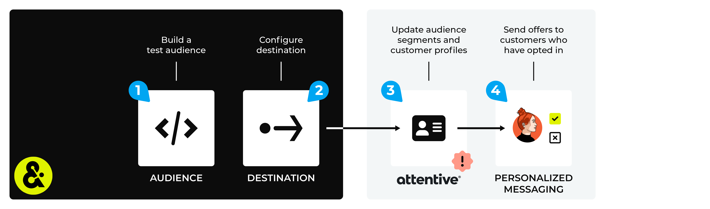

.. https://docs.amperity.com/legacy/

.. |destination-name| replace:: Attentive
.. |destination-api| replace:: Custom Attributes API
.. |plugin-name| replace:: Attentive
.. |what-send| replace:: audiences
.. |email-plus-send| replace:: additional attributes
.. |filter-the-list| replace:: "att"
.. |sftp-type| replace:: **attentive mobile**
.. |sftp-hostname| replace:: **sftp.attentivemobile.com**
.. |file-format| replace:: CSV
.. |encoding-method| replace:: Encoding method options include "Tar", "Tgz", "Zip", "GZip", and "None".
.. |sendto-link| replace:: |sendto_attentive_mobile|
.. |channel-link| replace:: |campaign_attentive_mobile|
.. |data-template-name| replace:: |destination-name|
.. |data-template-description| replace:: Send |what-send| to |destination-name|.
.. |data-template-config-settings-list| replace:: settings required by |destination-name| were
.. |data-template-config-settings-list-them-vs-it| replace:: them
.. |allow-for-what| replace:: audiences
.. |allow-for-duration| replace:: up to 24 hours
.. |credential-type| replace:: Attentive API
.. |credential-details| replace:: the Attentive API key, sign-up unit ID, and primary identifier

==================================================
Configure campaigns for Attentive
==================================================

.. note:: This topic contains information about configuring a destination to send audiences to |destination-name| using campaigns *and* for configuring a destination that sends query results using orchestrations, but have not yet been upgraded to the new user experience. To configure a destination that sends query results to |destination-name| using orchestrations see `this topic <https://docs.amperity.com/operator/destination_attentive_mobile.html>`__ |ext_link|.

.. include:: ../../shared/terms.rst
   :start-after: .. term-attentive-mobile-start
   :end-before: .. term-attentive-mobile-end

.. destination-attentive-mobile-start

Amperity can manage an audience in |destination-name| and attributes about that audience.

#. Send :ref:`audience segments <destination-attentive-segments>` to |destination-name| using a SFTP-based process.
#. Send customer attributes about that audience using the :ref:`Custom Attributes API <destination-attentive-attributes>`.

.. destination-attentive-mobile-end

.. _destination-attentive-howitworks:

How this destination works
==================================================

.. destination-attentive-howitworks-start

Amperity can manage audiences in |destination-name| and provide attributes about the customers who belong to those audiences. A segment is the list of customers to which you will send emails or messages. A subscriber is a customer for which you have an opt-in/out status. You can only send emails or messages to customers who have opted-in.

.. destination-attentive-howitworks-end

.. destination-attentive-howitworks-callouts-start

An |destination-name| destination works like this:

#. Use a query or segment to a) build a list of subscribers for whom you have opt-in/out data, and then b) build a segment that contains a list of customers to whom you want to send email or SMS messages.

#. Configure destinations that manage :ref:`audience segments <destination-attentive-segments>`, and then provide :ref:`attributes about the customers <destination-attentive-attributes>` who belong to those audiences.

   .. admonition:: Why are there two ways to send data to Attentive?

      Amperity uses the `Subscribers <https://docs.attentive.com/openapi/reference/tag/Subscribers/>`__ |ext_link| and `Custom Attributes <https://docs.attentivemobile.com/openapi/reference/tag/Custom-Attributes/>`__ |ext_link| endpoints in the |destination-api| to manage subscribers. Updates appear on the **Subscribers** page within your audience in |destination-name|.

      Amperity uses the `subscriber segment upload <https://docs.attentivemobile.com/pages/developer-guides/sftp-solution/subscriber-segment-upload/#subscriber-segment-upload>`__ |ext_link| process to manage segments. This process does not use an endpoint and is not subject to `Attentive API rate limits <https://docs.attentive.com/pages/api-rate-limits/>`__ |ext_link|. Updates appear on the **Segments** page within your audience in |destination-name|.

#. Send a test from Amperity, and then from within |destination-name| verify that the **Subscribers** page has the updated subscriber opt-in/out status and that the **Segments** page has the list of customers that you sent from Amperity.

.. destination-attentive-howitworks-callouts-end

.. _destination-attentive-segments:

Audience segments
==================================================

.. destination-attentive-segments-start

Amperity uses the `subscriber segment upload <https://docs.attentivemobile.com/pages/developer-guides/sftp-solution/subscriber-segment-upload/#subscriber-segment-upload>`__ |ext_link| process to manage segments. This process does not use an endpoint and is not subject to `Attentive API rate limits <https://docs.attentive.com/pages/api-rate-limits/>`__ |ext_link|. Updates appear on the **Segments** page within your audience in |destination-name|.

.. destination-attentive-segments-end

.. note::

   .. include:: ../../shared/destinations.rst
      :start-after: .. destinations-add-destinations-intro-allow-for-start
      :end-before: .. destinations-add-destinations-intro-allow-for-end

.. destination-attentive-segments-steps-to-send-start

.. include:: ../../shared/destinations.rst
   :start-after: .. destinations-overview-list-intro-start
   :end-before: .. destinations-overview-list-intro-end

#. :ref:`Get details <destination-attentive-segments-get-details>`
#. :ref:`Add destination <destination-attentive-segments-add-destination>`
#. :ref:`Add data template <destination-attentive-add-data-template>`

.. destination-attentive-segments-steps-to-send-end

.. _destination-attentive-segments-get-details:

Get details
--------------------------------------------------

.. destination-attentive-segments-get-details-start

|destination-name| requires the following configuration details for audience segments:

.. list-table::
   :widths: 10 90
   :header-rows: 0

   * - .. image:: ../../images/steps-check-off-black.png
          :width: 60 px
          :alt: Detail one.
          :align: left
          :class: no-scaled-link
     - The username and passphrase with permission to write data to Attentive Mobile using their SFTP process.

   * - .. image:: ../../images/steps-check-off-black.png
          :width: 60 px
          :alt: Detail one.
          :align: left
          :class: no-scaled-link
     - The remote folder to which Amperity will send data: ``/uploads``.

   * - .. image:: ../../images/steps-check-off-black.png
          :width: 60 px
          :alt: Detail one.
          :align: left
          :class: no-scaled-link
     - The public key to use for PGP encryption, if required.

   * - .. image:: ../../images/steps-check-off-black.png
          :width: 60 px
          :alt: Detail one.
          :align: left
          :class: no-scaled-link
     - Review the `subscriber segment upload <https://docs.attentivemobile.com/pages/developer-guides/sftp-solution/subscriber-segment-upload/#subscriber-segment-upload>`__ |ext_link| topic for specific requirements for how to format the CSV file.

   * - .. image:: ../../images/steps-check-off-black.png
          :width: 60 px
          :alt: Detail one.
          :align: left
          :class: no-scaled-link
     - Do not include header rows in output.

.. destination-attentive-segments-get-details-end

.. _destination-attentive-segments-add-destination:

Add destination
--------------------------------------------------

.. include:: ../../shared/destinations.rst
   :start-after: .. destinations-add-destinations-intro-all-start
   :end-before: .. destinations-add-destinations-intro-all-end

.. destination-attentive-segments-add-destination-important-start

.. important:: Be sure to use "Segments" in the destination title so that users of Amperity who will send segments to |destination-name| will be able to identify this destination. Review the `subscriber segment upload <https://docs.attentivemobile.com/pages/developer-guides/sftp-solution/subscriber-segment-upload/#subscriber-segment-upload>`__ |ext_link| topic for specific requirements for how to format the CSV file. Do not include header rows in output.

.. destination-attentive-segments-add-destination-important-end

**To add a destination**

.. destination-attentive-segments-add-destination-steps-start

.. list-table::
   :widths: 10 90
   :header-rows: 0

   * - .. image:: ../../images/steps-01.png
          :width: 60 px
          :alt: Step 1.
          :align: left
          :class: no-scaled-link
     - .. include:: ../../shared/destinations.rst
          :start-after: .. destinations-add-destination-start
          :end-before: .. destinations-add-destination-end

       .. image:: ../../images/mockup-destinations-tab-add-01-select.png
          :width: 500 px
          :alt: Name, description, choose plugin.
          :align: left
          :class: no-scaled-link

       .. include:: ../../shared/destinations.rst
          :start-after: .. destinations-add-name-and-description-start
          :end-before: .. destinations-add-name-and-description-end

   * - .. image:: ../../images/steps-02.png
          :width: 60 px
          :alt: Step 2.
          :align: left
          :class: no-scaled-link
     - .. include:: ../../shared/destinations.rst
          :start-after: .. destinations-add-credentials-sftp-start
          :end-before: .. destinations-add-credentials-sftp-end

       .. image:: ../../images/mockup-destinations-tab-add-02-credentials.png
          :width: 500 px
          :alt: Choose an existing credential or add credential.
          :align: left
          :class: no-scaled-link

       .. include:: ../../shared/destinations.rst
          :start-after: .. destinations-add-new-or-select-existing-start
          :end-before: .. destinations-add-new-or-select-existing-end

       .. include:: ../../shared/destinations.rst
          :start-after: .. destinations-intro-for-additional-settings-sftp-start
          :end-before: .. destinations-intro-for-additional-settings-sftp-end

       .. image:: ../../images/mockup-destinations-tab-add-02-credentials-sftp.png
          :width: 500 px
          :alt: Update the settings for the SFTP destination.
          :align: left
          :class: no-scaled-link

       .. include:: ../../shared/destinations.rst
          :start-after: .. destinations-save-settings-start
          :end-before: .. destinations-save-settings-end

   * - .. image:: ../../images/steps-03.png
          :width: 60 px
          :alt: Step 3.
          :align: left
          :class: no-scaled-link
     - .. include:: ../../shared/destinations.rst
          :start-after: .. destinations-destination-settings-start
          :end-before: .. destinations-destination-settings-end

       .. image:: ../../images/mockup-destinations-tab-add-03-settings-sftp.png
          :width: 500 px
          :alt: Settings for SFTP destinations.
          :align: left
          :class: no-scaled-link

       .. include:: ../../shared/destinations.rst
          :start-after: .. destinations-destination-settings-sftp-start
          :end-before: .. destinations-destination-settings-sftp-end

   * - .. image:: ../../images/steps-04.png
          :width: 60 px
          :alt: Step 4.
          :align: left
          :class: no-scaled-link
     - .. include:: ../../shared/destinations.rst
          :start-after: .. destinations-business-users-start
          :end-before: .. destinations-business-users-end

       .. include:: ../../shared/destinations.rst
          :start-after: .. destinations-business-users-admonition-start
          :end-before: .. destinations-business-users-admonition-end

   * - .. image:: ../../images/steps-05.png
          :width: 60 px
          :alt: Step 5.
          :align: left
          :class: no-scaled-link
     - .. include:: ../../shared/destinations.rst
          :start-after: .. destinations-save-start
          :end-before: .. destinations-save-end

.. destination-attentive-segments-add-destination-steps-end

.. _destination-attentive-attributes:

Custom attributes (API)
==================================================

.. destination-attentive-attributes-start

|destination-name| is your source of truth for your customers' subscription status, while Amperity is your source of truth for profile attributes that describe those customers.

Amperity uses the `Custom Attributes <https://docs.attentivemobile.com/openapi/reference/tag/Custom-Attributes/>`__ |ext_link| endpoint to send custom profile attributes to |destination-name|. Use these attributes to apply customizable data or characteristics to each of your subscribers, and then use that information to build segments for use with campaigns and journeys.

.. caution:: The |destination-name| |destination-api| allows you to build segments based on a match with customer profile attributes. Custom attributes `cannot contain any sensitive or special categories of information <https://docs.attentivemobile.com/pages/legal-docs/pi-disclaimer/>`__ |ext_link|.

.. destination-attentive-attributes-end

.. destination-attentive-attributes-steps-to-send-start

.. include:: ../../shared/destinations.rst
   :start-after: .. destinations-overview-list-intro-start
   :end-before: .. destinations-overview-list-intro-end

#. :ref:`Get details <destination-attentive-attributes-get-details>`
#. :ref:`Add destination <destination-attentive-attributes-add-destination>`
#. :ref:`Add data template <destination-attentive-add-data-template>`

.. destination-attentive-attributes-steps-to-send-end

.. _destination-attentive-attributes-get-details:

Get details
--------------------------------------------------

.. destination-attentive-attributes-get-details-start

The |destination-name| Custom Attributes API requires the following configuration details for sending audience subscribers:

.. list-table::
   :widths: 10 90
   :header-rows: 0

   * - .. image:: ../../images/steps-check-off-black.png
          :width: 60 px
          :alt: Detail one.
          :align: left
          :class: no-scaled-link
     - The |destination-name| API key.

   * - .. image:: ../../images/steps-check-off-black.png
          :width: 60 px
          :alt: Detail one.
          :align: left
          :class: no-scaled-link
     - The ID for the `sign-up unit <https://help.attentivemobile.com/hc/en-us/articles/360051443552-What-are-sign-up-units->`__ |ext_link|. Sign-up units are managed from the **Sign-up Units** page in |destination-name|. You must provide an ID for an active sign-up unit.

.. destination-attentive-attributes-get-details-end

.. _destination-attentive-attributes-add-destination:

Add destination
--------------------------------------------------

.. include:: ../../shared/destinations.rst
   :start-after: .. destinations-add-destinations-intro-all-start
   :end-before: .. destinations-add-destinations-intro-all-end

.. destination-attentive-attributes-add-destination-important-start

.. important:: |destination-name| accepts email addresses *or* phone numbers as the primary identifier. The set of data that is sent from Amperity **must** contain the primary identifier. For example, if your primary identifier is phone numbers, than the **phone** field must be included.

   You may send the non-primary email address or phone number as a custom attribute.

.. destination-attentive-attributes-add-destination-important-end

**To add a destination**

.. destination-attentive-attributes-add-destination-steps-start

.. list-table::
   :widths: 10 90
   :header-rows: 0

   * - .. image:: ../../images/steps-01.png
          :width: 60 px
          :alt: Step 1.
          :align: left
          :class: no-scaled-link
     - .. include:: ../../shared/destinations.rst
          :start-after: .. destinations-add-destination-start
          :end-before: .. destinations-add-destination-end

       .. image:: ../../images/mockup-destinations-tab-add-01-select.png
          :width: 500 px
          :alt: Name, description, choose plugin.
          :align: left
          :class: no-scaled-link

       .. include:: ../../shared/destinations.rst
          :start-after: .. destinations-add-name-and-description-start
          :end-before: .. destinations-add-name-and-description-end

   * - .. image:: ../../images/steps-02.png
          :width: 60 px
          :alt: Step 2.
          :align: left
          :class: no-scaled-link
     - .. include:: ../../shared/destinations.rst
          :start-after: .. destinations-add-credentials-start
          :end-before: .. destinations-add-credentials-end

       .. image:: ../../images/mockup-destinations-tab-add-02-credentials.png
          :width: 500 px
          :alt: Choose an existing credential or add credential.
          :align: left
          :class: no-scaled-link

       .. include:: ../../shared/destinations.rst
          :start-after: .. destinations-add-new-or-select-existing-start
          :end-before: .. destinations-add-new-or-select-existing-end

       .. image:: ../../images/mockup-destinations-tab-credentials-01-select.png
          :width: 500 px
          :alt: Choose an existing credential or add credential.
          :align: left
          :class: no-scaled-link

       .. include:: ../../shared/destinations.rst
          :start-after: .. destinations-intro-for-additional-settings-start
          :end-before: .. destinations-intro-for-additional-settings-end

       |destination-name| has the following settings:

       * The |destination-name| API key.

       .. include:: ../../shared/destinations.rst
          :start-after: .. destinations-save-settings-start
          :end-before: .. destinations-save-settings-end

   * - .. image:: ../../images/steps-03.png
          :width: 60 px
          :alt: Step 3.
          :align: left
          :class: no-scaled-link
     - .. include:: ../../shared/destinations.rst
          :start-after: .. destinations-destination-settings-start
          :end-before: .. destinations-destination-settings-end

       .. image:: ../../images/mockup-destinations-tab-add-03-settings.png
          :width: 500 px
          :alt: Settings for Campaign Monitor.
          :align: left
          :class: no-scaled-link

       The following settings are specific to |destination-name|:

       .. list-table::
          :widths: 180 320
          :header-rows: 1

          * - **Setting**
            - **Description**
          * - **Primary identifier**
            - The ID for the `sign-up unit <https://help.attentivemobile.com/hc/en-us/articles/360051443552-What-are-sign-up-units->`__ |ext_link|. Sign-up units are managed from the **Sign-up Units** page in |destination-name|. You must provide an ID for an active sign-up unit.

   * - .. image:: ../../images/steps-04.png
          :width: 60 px
          :alt: Step 4.
          :align: left
          :class: no-scaled-link
     - .. include:: ../../shared/destinations.rst
          :start-after: .. destinations-business-users-start
          :end-before: .. destinations-business-users-end

       .. include:: ../../shared/destinations.rst
          :start-after: .. destinations-business-users-admonition-start
          :end-before: .. destinations-business-users-admonition-end

   * - .. image:: ../../images/steps-05.png
          :width: 60 px
          :alt: Step 5.
          :align: left
          :class: no-scaled-link
     - .. include:: ../../shared/destinations.rst
          :start-after: .. destinations-save-start
          :end-before: .. destinations-save-end

.. destination-attentive-attributes-add-destination-steps-end

.. _destination-attentive-add-data-template:

Add data template
==================================================

.. include:: ../../shared/terms.rst
   :start-after: .. term-data-template-start
   :end-before: .. term-data-template-end

**To add a data template**

.. destination-attentive-add-data-template-steps-start

.. list-table::
   :widths: 10 90
   :header-rows: 0

   * - .. image:: ../../images/steps-01.png
          :width: 60 px
          :alt: Step 1.
          :align: left
          :class: no-scaled-link
     - .. include:: ../../shared/destinations.rst
          :start-after: .. destinations-data-template-open-template-start
          :end-before: .. destinations-data-template-open-template-end

       .. image:: ../../images/mockup-data-template-tab-add-01-details.png
          :width: 500 px
          :alt: Step 1
          :align: left
          :class: no-scaled-link

       .. include:: ../../shared/destinations.rst
          :start-after: .. destinations-data-template-open-template-name-start
          :end-before: .. destinations-data-template-open-template-name-end

   * - .. image:: ../../images/steps-02.png
          :width: 60 px
          :alt: Step 2.
          :align: left
          :class: no-scaled-link
     - .. include:: ../../shared/destinations.rst
          :start-after: .. destinations-data-template-business-users-start
          :end-before: .. destinations-data-template-business-users-end

       .. image:: ../../images/mockup-data-template-tab-add-02-allow-access.png
          :width: 500 px
          :alt: Step 2.
          :align: left
          :class: no-scaled-link

       .. include:: ../../shared/destinations.rst
          :start-after: .. destinations-data-template-business-users-access-not-configured-start
          :end-before: .. destinations-data-template-business-users-access-not-configured-end

       .. include:: ../../shared/destinations.rst
          :start-after: .. destinations-data-template-business-users-allow-campaigns-start
          :end-before: .. destinations-data-template-business-users-allow-campaigns-end

   * - .. image:: ../../images/steps-03.png
          :width: 60 px
          :alt: Step 3.
          :align: left
          :class: no-scaled-link
     - .. include:: ../../shared/destinations.rst
          :start-after: .. destinations-data-template-verify-config-settings-start
          :end-before: .. destinations-data-template-verify-config-settings-end

       .. image:: ../../images/mockup-data-template-tab-add-03-settings.png
          :width: 500 px
          :alt: Verify settings for the data template.
          :align: left
          :class: no-scaled-link

       .. include:: ../../shared/destinations.rst
          :start-after: .. destinations-data-template-verify-config-settings-note-start
          :end-before: .. destinations-data-template-verify-config-settings-note-end

   * - .. image:: ../../images/steps-04.png
          :width: 60 px
          :alt: Step 4.
          :align: left
          :class: no-scaled-link
     - .. include:: ../../shared/destinations.rst
          :start-after: .. destinations-data-template-save-start
          :end-before: .. destinations-data-template-save-end

       .. image:: ../../images/mockup-destinations-tab-add-05-save.png
          :width: 500 px
          :alt: Save the data template.
          :align: left
          :class: no-scaled-link

       .. include:: ../../shared/destinations.rst
          :start-after: .. destinations-data-template-save-after-start
          :end-before: .. destinations-data-template-save-after-end

.. destination-attentive-add-data-template-steps-end

.. _destination-attentive-add-data-template-about:

About filename templates
--------------------------------------------------

.. destination-attentive-add-data-template-intro-start

A filename template defines how the names of segments and campaigns will appear in |destination-name|.

.. destination-attentive-add-data-template-intro-end

.. destination-attentive-add-data-template-about-start

The following table shows how your segment name will appear in |destination-name|. These examples represent a one-time buyer campaign that is attempting to win a second purchase. The campaign is named "Winback" and it has sub-audiences for "Dress Shirts", "Jeans", and "Shoes". Keep these types of patterns in mind when naming campaigns, treatment groups, and sub-audiences within your campaigns that will be sent to |destination-name|.

.. list-table::
   :widths: 150 150 300
   :header-rows: 1

   * - Pattern
     - Segment names
     - Description

   * - (empty)
     - WinbackDressShirts

       WinbackJeans

       WinbackShoes
     - An empty filename template setting is the equivalent of **{{ campaign_name }}{{ group_name }}**.

   * - **campaign_name**
     - Winback
     - Use this pattern for campaigns that do not have more than one treatment group or sub-audiences. This will use the name of the campaign as the name of the segment in |destination-name|.

       .. tip:: Use **{{ campaign_name }}** *instead of* **{{ list_name }}**.

   * - **campaign_name + group_name**
     - Winback_DressShirts

       Winback_Jeans

       Winback_Shoes
     - Use this pattern for campaigns that have more than one treatment group and/or have sub-audiences.

       You may use an underscore ( _ ) or a hyphen ( - ): **{{ campaign_name }}_{{ group_name }}** or **{{ campaign_name }}-{{ group_name }}**.

       You may put them next to each other (without using an underscore or hyphen): **{{ campaign_name }}{{ group_name }}**.

       You may switch the ordering: **{{ group_name }}_{{ campaign_name }}**.

       .. tip:: Be sure to use descriptive names for campaigns *and* treatment groups and be careful to not use the default treatment group names when sending campaigns to |destination-name|.

          This will ensure that downstream users in |destination-name| will be able to understand what each segment is for and won't have to view default naming patterns like "Winback_Recipient1", "WinbackRecipient2", etc.
   * - **group_name**
     - DressShirts

       Jeans

       Shoes
     - Use this pattern to only use the names of treatment groups as segment names in |destination-name|. This will omit the name of the campaign *and* the name of the sub-audience from the segment name.

.. destination-attentive-add-data-template-about-end

.. destination-attentive-add-data-template-important-start

.. important:: The filename template, as used with |destination-name| (and unlike how it is used with other destinations), **does not** build a file name. Instead the filename template defines which strings (campaign and/or treatment group) will be used as the name of a segment in |destination-name|. Spaces in campaign and treatment group names are removed.

.. destination-attentive-add-data-template-important-end
