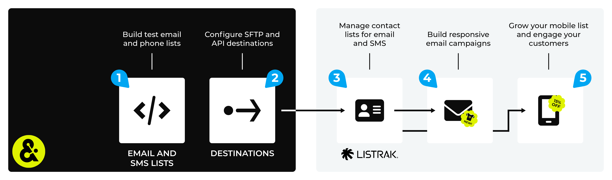

.. https://docs.amperity.com/legacy/

.. |destination-name| replace:: Listrak
.. |plugin-name| replace:: Listrak
.. |what-send| replace:: audience lists
.. |email-plus-send| replace:: additional attributes
.. |filter-the-list| replace:: "lis"
.. |credential-type| replace:: **listrak**
.. |credential-details| replace:: the Listrak client ID and secret
.. |data-template-name| replace:: |destination-name|
.. |data-template-description| replace:: Send |what-send| to |destination-name|.
.. |data-template-config-settings-list| replace:: settings required by |destination-name| were
.. |data-template-config-settings-list-them-vs-it| replace:: them
.. |sendto-link| replace:: |sendto_listrak|
.. |channel-link| replace:: |campaign_listrak|

==================================================
Send data to Listrak
==================================================

.. note:: This topic contains information about configuring a destination to send audiences to |destination-name| using campaigns *and* for configuring a destination that sends query results using orchestrations, but have not yet been upgraded to the new user experience. To configure a destination that sends query results to |destination-name| using orchestrations see `this topic <https://docs.amperity.com/operator/destination_listrak.html>`__ |ext_link|.

.. include:: ../../shared/terms.rst
   :start-after: .. term-listrak-start
   :end-before: .. term-listrak-end

.. _destination-listrak-howitworks:

How this destination works
==================================================

.. destination-listrak-howitworks-start

Amperity can manage email and SMS lists in |destination-name|. You can send email and SMS lists to |destination-name| using any of the following processes:

* The `Listrak Email API <https://api.listrak.com/email>`__ |ext_link|
* The `Listrak SMS API <https://api.listrak.com/sms>`__ |ext_link|
* SFTP for email address and/or SMS lists, along with product catalogs, orders, and ordered items

Additional attributes may be appended using any of these processes.

.. destination-listrak-howitworks-end

.. destination-listrak-howitworks-note-start

Amperity automatically adds a field attribute to all contact lists that are sent to |destination-name|. This field is located inside a field group named "Amperity Message Attributes" within |destination-name|.

.. destination-listrak-howitworks-note-end

.. destination-listrak-howitworks-callouts-start

An |destination-name| destination works like this:

#. Use a query or segment to build a list of email addresses or phone numbers for whom you have opt-in/out data.

#. Configure a destination for sending lists of email addresses and phone numbers to |destination-name| using your preferred workflow: :ref:`API <destination-listrak-api>` or :ref:`SFTP <destination-listrak-sftp>`.

   |destination-name| prefers to use a single list for managing email addresses and phone numbers. These lists are named "Master List" by default within |destination-name|. This is the name of the list that is most often managed when data is sent to |destination-name| from Amperity.

#. Send a test from Amperity using your preferred workflow, and then from within |destination-name| verify that the email and phone lists are updated.

   .. tip:: Lists are available from the **Contacts** page within the Listrak user interface. If you are not sure which list (or lists) should be managed by Amperity, work with your Listrak representative to determine the best approach for list management.

#. Use `email lists <https://help.listrak.com/en/articles/1509335-listrak-email-lists-the-list-manager>`__ |ext_link| to build responsive email campaigns.

#. Use `SMS lists <https://help.listrak.com/en/articles/4853719-sms-lists-management-guide>`__ |ext_link| to grow your mobile list and engage with your customers.

.. destination-listrak-howitworks-callouts-end

.. _destination-listrak-api:

Email and SMS APIs
==================================================

.. destination-listrak-api-start

Use Amperity to manage email address and phone number lists in |destination-name| using the `Listrak Email API <https://api.listrak.com/email>`__ |ext_link| or `Listrak SMS API <https://api.listrak.com/sms>`__ |ext_link|.

Build a query or segment that returns an **email** field or **phone** field, and then send that list to |destination-name|.

.. destination-listrak-api-end

.. _destination-listrak-api-get-details:

Get details
--------------------------------------------------

.. destination-listrak-api-get-details-start

|destination-name| requires the following configuration details:

.. list-table::
   :widths: 10 90
   :header-rows: 0

   * - .. image:: ../../images/steps-check-off-black.png
          :width: 60 px
          :alt: Detail one.
          :align: left
          :class: no-scaled-link
     - A client ID and secret for an email integration *and/or* a client ID and secret for an SMS integration. These integrations must already be set up in |destination-name|.

       .. important:: The Amperity |ext_amperity_allowlist_ip_address| must also be added to the allowlist of the |destination-name| integration.

   * - .. image:: ../../images/steps-check-off-black.png
          :width: 60 px
          :alt: Detail one.
          :align: left
          :class: no-scaled-link
     - The name of the list that will be managed in |destination-name|. This is often, but not always, named "Master List".

   * - .. image:: ../../images/steps-check-off-black.png
          :width: 60 px
          :alt: Detail one.
          :align: left
          :class: no-scaled-link
     - A query or segment that returns a list of email addresses *or* phone numbers.

.. destination-listrak-api-get-details-end

.. _destination-listrak-api-add-destination:

Add destination
--------------------------------------------------

.. include:: ../../shared/destinations.rst
   :start-after: .. destinations-add-destinations-intro-all-start
   :end-before: .. destinations-add-destinations-intro-all-end

.. destination-listrak-api-add-destination-start

.. note:: You may append additional profile attributes to the query or segment that you use to build the list of email addresses or phone numbers.

.. destination-listrak-api-add-destination-end

**To add a destination**

.. destination-listrak-api-add-destination-steps-start

.. list-table::
   :widths: 10 90
   :header-rows: 0

   * - .. image:: ../../images/steps-01.png
          :width: 60 px
          :alt: Step 1.
          :align: left
          :class: no-scaled-link
     - .. include:: ../../shared/destinations.rst
          :start-after: .. destinations-add-destination-start
          :end-before: .. destinations-add-destination-end

       .. image:: ../../images/mockup-destinations-tab-add-01-select.png
          :width: 500 px
          :alt: Name, description, choose plugin.
          :align: left
          :class: no-scaled-link

       .. include:: ../../shared/destinations.rst
          :start-after: .. destinations-add-name-and-description-start
          :end-before: .. destinations-add-name-and-description-end

   * - .. image:: ../../images/steps-02.png
          :width: 60 px
          :alt: Step 2.
          :align: left
          :class: no-scaled-link
     - .. include:: ../../shared/destinations.rst
          :start-after: .. destinations-add-credentials-start
          :end-before: .. destinations-add-credentials-end

       .. image:: ../../images/mockup-destinations-tab-add-02-credentials.png
          :width: 500 px
          :alt: Choose an existing credential or add credential.
          :align: left
          :class: no-scaled-link

       .. include:: ../../shared/destinations.rst
          :start-after: .. destinations-add-new-or-select-existing-start
          :end-before: .. destinations-add-new-or-select-existing-end

       .. image:: ../../images/mockup-destinations-tab-credentials-01-select.png
          :width: 500 px
          :alt: Choose an existing credential or add credential.
          :align: left
          :class: no-scaled-link

       .. include:: ../../shared/destinations.rst
          :start-after: .. destinations-intro-for-additional-settings-start
          :end-before: .. destinations-intro-for-additional-settings-end

       |destination-name| has the following settings:

       * A client ID and secret for an email integration that is already set up in |destination-name|.
       * A client ID and secret for an SMS integration that is already set up in |destination-name|.

       .. include:: ../../shared/destinations.rst
          :start-after: .. destinations-save-settings-start
          :end-before: .. destinations-save-settings-end

   * - .. image:: ../../images/steps-03.png
          :width: 60 px
          :alt: Step 3.
          :align: left
          :class: no-scaled-link
     - .. include:: ../../shared/destinations.rst
          :start-after: .. destinations-destination-settings-start
          :end-before: .. destinations-destination-settings-end

       .. image:: ../../images/mockup-destinations-tab-add-03-settings.png
          :width: 500 px
          :alt: Settings for Listrak.
          :align: left
          :class: no-scaled-link

       The following settings are specific to |destination-name|:

       .. list-table::
          :widths: 180 320
          :header-rows: 1

          * - **Setting**
            - **Description**
          * - **List name**
            - The name of the list that will be managed in |destination-name|. This is often, but not always, named "Master List".

   * - .. image:: ../../images/steps-04.png
          :width: 60 px
          :alt: Step 4.
          :align: left
          :class: no-scaled-link
     - .. include:: ../../shared/destinations.rst
          :start-after: .. destinations-business-users-start
          :end-before: .. destinations-business-users-end

       .. include:: ../../shared/destinations.rst
          :start-after: .. destinations-business-users-admonition-start
          :end-before: .. destinations-business-users-admonition-end

   * - .. image:: ../../images/steps-05.png
          :width: 60 px
          :alt: Step 5.
          :align: left
          :class: no-scaled-link
     - .. include:: ../../shared/destinations.rst
          :start-after: .. destinations-save-start
          :end-before: .. destinations-save-end

.. destination-listrak-api-add-destination-steps-end

.. _destination-listrak-sftp:

SFTP
==================================================

.. destination-listrak-sftp-start

Configure Amperity to send email addresses and/or phone numbers to |destination-name| using SFTP. This option uses the SFTP destination that is built into Amperity and should follow the steps and requirements that are outlined in the |destination-name| `file import guide <https://help.listrak.com/en/articles/1669274-file-import-guide>`__ |ext_link|.

You can use SFTP to send the following sets of data to |destination-name|.

#. `Customers <https://www.listrak.com/product-team/customer-schema>`__ |ext_link|
#. `Products <https://www.listrak.com/product-team/product-schema>`__ |ext_link|
#. `Orders <https://www.listrak.com/product-team/order-schema>`__ |ext_link|
#. `Order items <https://www.listrak.com/product-team/order-items-schema>`__ |ext_link|

Work with your Listrak representatives to determine which of these sets will be useful for your workflows within |destination-name|, and then verify that attributes sent from Amperity are mapped correctly to the appropriate data schema within |destination-name|.

.. destination-listrak-sftp-end

.. _destination-listrak-add-data-template:

Add data template
==================================================

.. include:: ../../shared/terms.rst
   :start-after: .. term-data-template-start
   :end-before: .. term-data-template-end

**To add a data template**

.. destination-listrak-add-data-template-steps-start

.. list-table::
   :widths: 10 90
   :header-rows: 0

   * - .. image:: ../../images/steps-01.png
          :width: 60 px
          :alt: Step 1.
          :align: left
          :class: no-scaled-link
     - .. include:: ../../shared/destinations.rst
          :start-after: .. destinations-data-template-open-template-start
          :end-before: .. destinations-data-template-open-template-end

       .. image:: ../../images/mockup-data-template-tab-add-01-details.png
          :width: 500 px
          :alt: Step 1
          :align: left
          :class: no-scaled-link

       .. include:: ../../shared/destinations.rst
          :start-after: .. destinations-data-template-open-template-name-start
          :end-before: .. destinations-data-template-open-template-name-end

   * - .. image:: ../../images/steps-02.png
          :width: 60 px
          :alt: Step 2.
          :align: left
          :class: no-scaled-link
     - .. include:: ../../shared/destinations.rst
          :start-after: .. destinations-data-template-business-users-start
          :end-before: .. destinations-data-template-business-users-end

       .. image:: ../../images/mockup-data-template-tab-add-02-allow-access.png
          :width: 500 px
          :alt: Step 2.
          :align: left
          :class: no-scaled-link

       .. include:: ../../shared/destinations.rst
          :start-after: .. destinations-data-template-business-users-access-not-configured-start
          :end-before: .. destinations-data-template-business-users-access-not-configured-end

       .. include:: ../../shared/destinations.rst
          :start-after: .. destinations-data-template-business-users-allow-campaigns-start
          :end-before: .. destinations-data-template-business-users-allow-campaigns-end

   * - .. image:: ../../images/steps-03.png
          :width: 60 px
          :alt: Step 3.
          :align: left
          :class: no-scaled-link
     - .. include:: ../../shared/destinations.rst
          :start-after: .. destinations-data-template-verify-config-settings-start
          :end-before: .. destinations-data-template-verify-config-settings-end

       .. image:: ../../images/mockup-data-template-tab-add-03-settings.png
          :width: 500 px
          :alt: Verify settings for the data template.
          :align: left
          :class: no-scaled-link

       .. include:: ../../shared/destinations.rst
          :start-after: .. destinations-data-template-verify-config-settings-note-start
          :end-before: .. destinations-data-template-verify-config-settings-note-end

   * - .. image:: ../../images/steps-04.png
          :width: 60 px
          :alt: Step 4.
          :align: left
          :class: no-scaled-link
     - .. include:: ../../shared/destinations.rst
          :start-after: .. destinations-data-template-save-start
          :end-before: .. destinations-data-template-save-end

       .. image:: ../../images/mockup-destinations-tab-add-05-save.png
          :width: 500 px
          :alt: Save the data template.
          :align: left
          :class: no-scaled-link

       .. include:: ../../shared/destinations.rst
          :start-after: .. destinations-data-template-save-after-start
          :end-before: .. destinations-data-template-save-after-end

.. destination-listrak-add-data-template-steps-end
