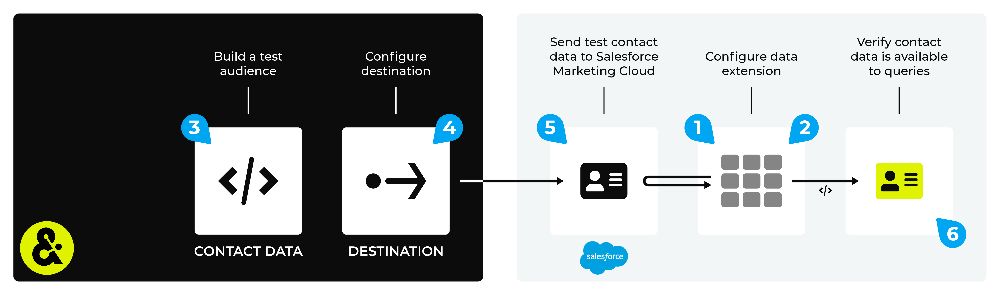

.. https://docs.amperity.com/legacy/

.. |destination-name| replace:: Salesforce Marketing Cloud
.. |plugin-name| replace:: Salesforce Marketing Cloud
.. |credential-type| replace:: salesforce-marketing-cloud
.. |what-send| replace:: CSV files
.. |email-plus-send| replace:: additional attributes
.. |filter-the-list| replace:: "sales"
.. |data-template-name| replace:: Salesforce Marketing Cloud
.. |data-template-description| replace:: Send audiences to Salesforce Marketing Cloud.
.. |data-template-campaigns-step| replace:: in step 4
.. |data-template-config-settings-list| replace:: account ID, import location, folder name, and primary key settings were
.. |data-template-config-settings-list-them-vs-it| replace:: them
.. |sendto-link| replace:: |sendto_salesforce_marketing_cloud|
.. |channel-link| replace:: |campaign_salesforce_marketing_cloud|

==================================================
Send data to Salesforce Marketing Cloud
==================================================

.. vale off

.. note:: This topic contains information about configuring a destination to send audiences to |destination-name| using campaigns *and* for configuring a destination that sends query results using orchestrations, but have not yet been upgraded to the new user experience. To configure a destination that sends query results to |destination-name| using orchestrations see `this topic <https://docs.amperity.com/operator/destination_salesforce_marketing_cloud.html>`__ |ext_link|.

.. vale on

.. include:: ../../shared/terms.rst
   :start-after: .. term-salesforce-marketing-cloud-start
   :end-before: .. term-salesforce-marketing-cloud-end

.. destination-salesforce-marketing-cloud-steps-to-send-start

.. include:: ../../shared/destinations.rst
   :start-after: .. destinations-overview-list-intro-start
   :end-before: .. destinations-overview-list-intro-end

#. :ref:`Get details <destination-salesforce-marketing-cloud-get-details>`
#. :ref:`Add destination <destination-salesforce-marketing-cloud-add-destination>`
#. :ref:`Add data template <destination-salesforce-marketing-cloud-add-data-template>`

.. destination-salesforce-marketing-cloud-steps-to-send-end

.. _destination-salesforce-marketing-cloud-howitworks:

How this destination works
==================================================

.. destination-salesforce-marketing-cloud-howitworks-start

Amperity can send |what-send| with contact data to business units in |destination-name|. The |what-send| are uploaded to |destination-name| using SFTP, after which the Marketing Cloud SOAP API is used to manage data extensions and to move contacts data from the |what-send| into the data extensions.

.. destination-salesforce-marketing-cloud-howitworks-end

.. destination-salesforce-marketing-cloud-howitworks-callouts-start

A |destination-name| destination works like this:

.. list-table::
   :widths: 10 90
   :header-rows: 0

   * - .. image:: ../../images/steps-01.png
          :width: 60 px
          :alt: Step one.
          :align: center
          :class: no-scaled-link
     - Optional. Configure a data extension in |destination-name|.

       .. admonition:: What is a data extension?

          A `data extension <https://help.salesforce.com/s/articleView?id=sf.mc_cab_data_extensions.htm&type=5>`__ |ext_link| is a table that stores data about your contacts. The fields that are available from your data extension match the columns and attributes that are sent from Amperity.

          Within |destination-name|, use the data in the data extension as a data source. Run queries, pull a subset of contacts from the data extension, and then send offers to that subset of contacts.

       This step is optional because Amperity manages the data extension as part of its workflow. If the data extension does not exist, Amperity adds it. If the data extension does exist, Amperity updates the contact data in that data extension.

   * - .. image:: ../../images/steps-02.png
          :width: 60 px
          :alt: Step two.
          :align: center
          :class: no-scaled-link
     - Configure permissions for the installed package to allow business units to read from and write to the data extension.

       .. admonition:: When does Amperity use an API?

          Amperity uses the `Marketing Cloud SOAP API <https://developer.salesforce.com/docs/marketing/marketing-cloud/guide/soap_tech_articles_de.html>`__ |ext_link| to manage the installed package and manage the `import definition <https://help.salesforce.com/s/articleView?id=sf.mc_cab_imports.htm&type=5>`__ |ext_link| process, which gets the contact data from the |what-send| that were sent from Amperity and then either adds a data extension or updates an existing data extension.

       .. note:: You may configure Amperity to send |what-send| to |destination-name| using only SFTP. This places the |what-send| in the configured SFTP location, but requires configuring the `data extension <https://help.salesforce.com/s/articleView?id=sf.mc_cab_data_extensions.htm&type=5>`__ |ext_link| and `import definition <https://help.salesforce.com/s/articleView?id=sf.mc_cab_imports.htm&type=5>`__ |ext_link| and any process that moves that data from the SFTP location to the data extension.

   * - .. image:: ../../images/steps-03.png
          :width: 60 px
          :alt: Step three.
          :align: center
          :class: no-scaled-link
     - Use a query or segment to build a list of contacts.

       The fields that are sent from Amperity must match the fields that are defined in the schema for the data extension in |destination-name|.

   * - .. image:: ../../images/steps-04.png
          :width: 60 px
          :alt: Step four.
          :align: center
          :class: no-scaled-link
     - Configure the :ref:`Salesforce Marketing Cloud destination <destination-salesforce-marketing-cloud-add-destination>` in Amperity.

       .. admonition:: Why does Amperity use SFTP?

          Amperity uses SFTP to transfer data to |destination-name|.

          |destination-name| has strict rate limits when using their APIs to manage contact data. These rate limits exceed the number of contacts that are in the lists sent to |destination-name|.

          Amperity uses SFTP to ensure that your contact lists can be successfully updated in |destination-name|, after which Amperity uses the Marketing Cloud SOAP API to make that list of contacts available to the configured data extension.

   * - .. image:: ../../images/steps-05.png
          :width: 60 px
          :alt: Step five.
          :align: center
          :class: no-scaled-link
     - Send a test from Amperity.

       .. important:: Be sure to send all fields required by the data extension in |destination-name|.

   * - .. image:: ../../images/steps-06.png
          :width: 60 px
          :alt: Step six.
          :align: center
          :class: no-scaled-link
     - From within |destination-name| verify the data that has been loaded to the data extension is correct and that you can run a query against it.

.. destination-salesforce-marketing-cloud-howitworks-callouts-end

.. _destination-salesforce-marketing-cloud-get-details:

Get details
==================================================

.. destination-salesforce-marketing-cloud-get-details-start

|destination-name| requires the following configuration details:

.. list-table::
   :widths: 10 90
   :header-rows: 0

   * - .. image:: ../../images/steps-check-off-black.png
          :width: 60 px
          :alt: Detail one.
          :align: center
          :class: no-scaled-link
     - For the installed package: the API client ID, API client secret, and the `SOAP base URI for the authentication subdomain <https://developer.salesforce.com/docs/marketing/marketing-cloud/guide/your-subdomain-tenant-specific-endpoints.html>`__ |ext_link|.

       .. admonition:: What is the authentication subdomain for the SOAP base URI?

          Your authentication subdomain is represented by a 28-character string that starts with the letters "mc", such as "mcabc123". The subdomain is part of the SOAP base URI for |destination-name|.

   * - .. image:: ../../images/steps-check-off-black.png
          :width: 60 px
          :alt: Detail two.
          :align: center
          :class: no-scaled-link
     - Within |destination-name|, configure the installed package to allow business units:

       #. Apply **Read** and **Write** permissions to the data extension.
       #. Apply **Read**, **Write**, and **Execute** permissions for Automations.

       .. important:: Each installed package is configured to have access to one business unit *or* multiple business units, depending on the desired workflow.

          Configure a data template for each busines unit to which you want to send data. When a single installed package has permissions to multiple business units, you must configure a data template for each business unit.

          Amperity cannot send data to a shared business unit in |destination-name|.

   * - .. image:: ../../images/steps-check-off-black.png
          :width: 60 px
          :alt: Detail three.
          :align: center
          :class: no-scaled-link
     - For SFTP configuation: the hostname, username, and passphrase.

       .. note:: The username is not the same as the email address that is associated with the user.

       .. admonition:: What is the SFTP hostname?

          Your SFTP hostname is represented by the same 28-character string that starts with the letters "mc", such as "mcabc123". This is the same 28-character string that represents the subdomain, which is part of the SOAP base URI for |destination-name|.

   * - .. image:: ../../images/steps-check-off-black.png
          :width: 60 px
          :alt: Detail four.
          :align: center
          :class: no-scaled-link
     - For each business unit to which data is sent: the account ID for the business unit, the import location, and selecting the field to use as the primary key.

       .. note:: The account ID is also referred to as the member ID within |destination-name|.

       .. important:: Review the `Marketing Cloud File Location Guide <https://help.salesforce.com/s/articleView?id=mktg.mc_overview_create_file_transfer_location.htm&type=5>`__ |ext_link| to configure a File Transfer Location with Location Type "Marketing Cloud Enhanced FTP Site Import Directory".

   * - .. image:: ../../images/steps-check-off-black.png
          :width: 60 px
          :alt: Detail five.
          :align: center
          :class: no-scaled-link
     - The :ref:`subscriber key <destination-salesforce-marketing-cloud-subscriber-key>` for |destination-name|. (The use of the subscriber key is recommended.)

       .. important:: A subscriber key is configured as the "primary key" for the destination. Do one of the following: use the |destination-name| subscriber key or use **email**. One of these options must be specified before the destination can send data to |destination-name|.

   * - .. image:: ../../images/steps-check-off-black.png
          :width: 60 px
          :alt: Detail six.
          :align: center
          :class: no-scaled-link
     - Review the `Marketing Cloud SFTP Guide <https://help.salesforce.com/articleView?id=mc_es_enhanced_ftp_guide.htm>`__ |ext_link| to answer questions about configuring and managing |destination-name|.

       .. tip:: Configuration details for |destination-name| are available from within Salesforce.

          #. For the installed package, click **Setup** > **Platform tools** > **Aps** > **Installed packages**.
          #. For SFTP, click **Setup** > **Administration** > **Data management** > **FTP accounts**.

.. destination-salesforce-marketing-cloud-get-details-end

.. _destination-salesforce-marketing-cloud-subscriber-key:

Subscriber key
--------------------------------------------------

.. destination-salesforce-marketing-cloud-subscriber-key-start

The subscriber key is an identifier in |destination-name|. All data that is sent to |destination-name| must be associated to a subscriber key. Use the **primary key** field while configuring |destination-name| to specify the subscriber key to use for this destination.

The use of the subscriber key within Amperity varies, depending on if the subscriber key is made available to Amperity as field provided by a |destination-name| data source:

.. list-table::
   :widths: 10 90
   :header-rows: 0

   * - .. image:: ../../images/steps-arrow-off-black.png
          :width: 60 px
          :alt: Detail one.
          :align: center
          :class: no-scaled-link
     - When a subscriber key is available, ensure that it is made available to the **Customer 360**, **Queries**, and **Segments** pages and that it may be included in queries and segments that is sent to |destination-name|.

       Use a customer key semantic tag, such as "fk-salesforce-subscriber key", to identify the subscriber key in your data sources.

       .. tip:: Use an email address as the subscriber key if the subscriber key identifier is unavailable.

   * - .. image:: ../../images/steps-arrow-off-black.png
          :width: 60 px
          :alt: Detail two.
          :align: center
          :class: no-scaled-link
     - The **primary key** field **must** be set to **subscriber_key** or **email** as part of the configuration of the data template that is used for this destination.

       .. caution:: A mismatch between the primary key in Amperity and the subscriber key in |destination-name| will cause duplicate records to be created.

.. destination-salesforce-marketing-cloud-subscriber-key-end

.. _destination-salesforce-marketing-cloud-sftp-password:

SFTP password expiration
--------------------------------------------------

.. destination-salesforce-marketing-cloud-sftp-password-start

The SFTP password for |destination-name| may be set to periodically expire. The default for SFTP passwords is 3 months. The SFTP password is configured in |destination-name| at **Setup** > **Settings** > **Security** > **Security Settings** > **Password Policies** > **Exclude FTP Users From Password Expiration**.

.. destination-salesforce-marketing-cloud-sftp-password-end

.. _destination-salesforce-marketing-cloud-add-destination:

Add destination
==================================================

.. include:: ../../shared/destinations.rst
   :start-after: .. destinations-add-destinations-intro-all-start
   :end-before: .. destinations-add-destinations-intro-all-end

**To add a destination**

.. destination-salesforce-marketing-cloud-add-destination-steps-start

.. list-table::
   :widths: 10 90
   :header-rows: 0

   * - .. image:: ../../images/steps-01.png
          :width: 60 px
          :alt: Step one.
          :align: center
          :class: no-scaled-link
     - .. include:: ../../shared/destinations.rst
          :start-after: .. destinations-add-destination-start
          :end-before: .. destinations-add-destination-end

       .. image:: ../../images/mockup-destinations-tab-add-01-select.png
          :width: 500 px
          :alt: Name, description, choose plugin.
          :align: left
          :class: no-scaled-link

       .. include:: ../../shared/destinations.rst
          :start-after: .. destinations-add-name-and-description-start
          :end-before: .. destinations-add-name-and-description-end

   * - .. image:: ../../images/steps-02.png
          :width: 60 px
          :alt: Step two.
          :align: center
          :class: no-scaled-link
     - .. include:: ../../shared/destinations.rst
          :start-after: .. destinations-add-credentials-start
          :end-before: .. destinations-add-credentials-end

       .. image:: ../../images/mockup-destinations-tab-add-02-credentials.png
          :width: 500 px
          :alt: Choose an existing credential or add credential.
          :align: left
          :class: no-scaled-link

       .. include:: ../../shared/destinations.rst
          :start-after: .. destinations-add-new-or-select-existing-start
          :end-before: .. destinations-add-new-or-select-existing-end

       .. image:: ../../images/mockup-destinations-tab-credentials-01-select.png
          :width: 500 px
          :alt: Choose an existing credential or add credential.
          :align: left
          :class: no-scaled-link

       .. include:: ../../shared/destinations.rst
          :start-after: .. destinations-intro-for-additional-settings-start
          :end-before: .. destinations-intro-for-additional-settings-end

       |destination-name| has two groups of configuration settings: one for your |destination-name| SFTP site and the other for the Marketing Cloud SOAP API.

       Amperity sends data to your |destination-name| SFTP site. Configure the following values for the SFTP site:

       * Hostname
       * Username
       * Passphrase

       The Marketing Cloud SOAP API picks up data from your |destination-name| SFTP site, and then loads that data to a data extension. Configure the following values for the Marketing Cloud SOAP API:

       * Client ID
       * Client secret
       * Authentication subdomain

       .. include:: ../../shared/destinations.rst
          :start-after: .. destinations-save-settings-start
          :end-before: .. destinations-save-settings-end

   * - .. image:: ../../images/steps-03.png
          :width: 60 px
          :alt: Step three.
          :align: center
          :class: no-scaled-link
     - .. include:: ../../shared/destinations.rst
          :start-after: .. destinations-destination-settings-start
          :end-before: .. destinations-destination-settings-end

       .. image:: ../../images/mockup-destinations-tab-add-03-settings.png
          :width: 500 px
          :alt: Settings for Salesforce Marketing Cloud.
          :align: left
          :class: no-scaled-link

       The following settings are specific to |destination-name|:

       .. list-table::
          :widths: 180 320
          :header-rows: 1

          * - **Setting**
            - **Description**
          * - **Account ID**
            - The account ID for the business unit in |destination-name|.
          * - **Import location**
            - The directory within the |destination-name| SFTP server into which data should be added. This is also the location from which the Marketing Cloud SOAP API will get the |what-send|.
          * - **Folder name**
            - The directory within the |destination-name| SFTP site from which the Marketing Cloud SOAP API will get CSV files.
          * - **Primary key**
            - Set to one of the following: **subscriber_key** or **email**.

              Use **subscriber_key** when a field can be mapped directly to the subscriber key in |destination-name|, or else choose **email**.

       .. important:: Settings that are not configured as part of the destination is required by the data template.

   * - .. image:: ../../images/steps-04.png
          :width: 60 px
          :alt: Step four.
          :align: center
          :class: no-scaled-link
     - .. include:: ../../shared/destinations.rst
          :start-after: .. destinations-business-users-start
          :end-before: .. destinations-business-users-end

       .. include:: ../../shared/destinations.rst
          :start-after: .. destinations-business-users-admonition-start
          :end-before: .. destinations-business-users-admonition-end

   * - .. image:: ../../images/steps-05.png
          :width: 60 px
          :alt: Step five.
          :align: center
          :class: no-scaled-link
     - .. include:: ../../shared/destinations.rst
          :start-after: .. destinations-save-start
          :end-before: .. destinations-save-end

.. destination-salesforce-marketing-cloud-add-destination-steps-end

.. _destination-salesforce-marketing-cloud-add-data-template:

Add data template
==================================================

.. include:: ../../shared/terms.rst
   :start-after: .. term-data-template-start
   :end-before: .. term-data-template-end

**To add a data template**

.. destination-salesforce-marketing-cloud-add-data-template-steps-start

.. list-table::
   :widths: 10 90
   :header-rows: 0

   * - .. image:: ../../images/steps-01.png
          :width: 60 px
          :alt: Step one.
          :align: center
          :class: no-scaled-link
     - .. include:: ../../shared/destinations.rst
          :start-after: .. destinations-data-template-open-template-start
          :end-before: .. destinations-data-template-open-template-end

       .. image:: ../../images/mockup-data-template-tab-add-01-details.png
          :width: 500 px
          :alt: Name and description of data template.
          :align: left
          :class: no-scaled-link

       .. include:: ../../shared/destinations.rst
          :start-after: .. destinations-data-template-open-template-name-start
          :end-before: .. destinations-data-template-open-template-name-end

   * - .. image:: ../../images/steps-02.png
          :width: 60 px
          :alt: Step two.
          :align: center
          :class: no-scaled-link
     - .. include:: ../../shared/destinations.rst
          :start-after: .. destinations-data-template-business-users-start
          :end-before: .. destinations-data-template-business-users-end

       .. image:: ../../images/mockup-data-template-tab-add-02-allow-access.png
          :width: 500 px
          :alt: Allow access to orchestrations and campaigns and to send customer profile data.
          :align: left
          :class: no-scaled-link

       .. include:: ../../shared/destinations.rst
          :start-after: .. destinations-data-template-business-users-access-not-configured-start
          :end-before: .. destinations-data-template-business-users-access-not-configured-end

       .. include:: ../../shared/destinations.rst
          :start-after: .. destinations-data-template-business-users-allow-campaigns-start
          :end-before: .. destinations-data-template-business-users-allow-campaigns-end

   * - .. image:: ../../images/steps-03.png
          :width: 60 px
          :alt: Step three.
          :align: center
          :class: no-scaled-link
     - .. include:: ../../shared/destinations.rst
          :start-after: .. destinations-data-template-verify-config-settings-start
          :end-before: .. destinations-data-template-verify-config-settings-end

       .. image:: ../../images/mockup-data-template-tab-add-03-settings.png
          :width: 500 px
          :alt: Verify settings for the data template.
          :align: left
          :class: no-scaled-link

       .. include:: ../../shared/destinations.rst
          :start-after: .. destinations-data-template-verify-config-settings-note-start
          :end-before: .. destinations-data-template-verify-config-settings-note-end

   * - .. image:: ../../images/steps-04.png
          :width: 60 px
          :alt: Step four.
          :align: center
          :class: no-scaled-link
     - Configure how Amperity sends data to the data extension in |destination-name|.

       Amperity overwrites the data in the data extension by default. Enable the **Append Data** option to append data instead of overwriting it.

       Set the name of the data extension you want to create or update. This data extension is in the business unit within |destination-name| that is associated with the credentials you provided.

       **For campaigns**

       .. image:: ../../images/mockup-data-template-tab-add-04-sfmc-extension-campaign.png
          :width: 500 px
          :alt: Configure data extension settings.
          :align: left
          :class: no-scaled-link

       Use the **{campaign_name}** and **{group_name}** campaign template variables to assign campaign and treatment group names to your data extension.

       .. important:: The name of a data extension must be unique within |destination-name|.

       **For orchestrations**

       .. image:: ../../images/mockup-data-template-tab-add-04-sfmc-extension-orchestration.png
          :width: 500 px
          :alt: Configure data extension settings.
          :align: left
          :class: no-scaled-link

       Assign a name to the data extension that will be added or updated by Amperity.

       .. important:: The name of a data extension must be unique within |destination-name|, should use underscores ``_`` instead of spaces, and may not contain *any* of the following characters:

          .. code-block::

             ! @ # $ % ^ * ( ) = { } [ ] \ . < > / " : ? | , &

   * - .. image:: ../../images/steps-05.png
          :width: 60 px
          :alt: Step five.
          :align: center
          :class: no-scaled-link
     - .. include:: ../../shared/destinations.rst
          :start-after: .. destinations-data-template-save-start
          :end-before: .. destinations-data-template-save-end

       .. image:: ../../images/mockup-destinations-tab-add-05-save.png
          :width: 500 px
          :alt: Save the data template.
          :align: left
          :class: no-scaled-link

       .. include:: ../../shared/destinations.rst
          :start-after: .. destinations-data-template-save-after-start
          :end-before: .. destinations-data-template-save-after-end

.. destination-salesforce-marketing-cloud-add-data-template-steps-end

.. _destination-salesforce-marketing-cloud-workflow-actions:

Workflow actions
==================================================

.. include:: ../../shared/workflow-actions.rst
   :start-after: .. workflow-actions-common-table-intro-start
   :end-before: .. workflow-actions-common-table-intro-end

.. destination-salesforce-marketing-cloud-workflow-actions-start

.. list-table::
   :widths: 10 90
   :header-rows: 0

   * - .. image:: ../../images/steps-01.png
          :width: 60 px
          :alt: Step one.
          :align: center
          :class: no-scaled-link
     - .. include:: ../../shared/workflow-actions.rst
          :start-after: .. workflow-actions-common-table-section-one-a-start
          :end-before: .. workflow-actions-common-table-section-one-a-end

       .. image:: ../../images/mockup-destinations-tab-workflow-error.png
          :width: 500 px
          :alt: Review a notifications error.
          :align: left
          :class: no-scaled-link

       .. include:: ../../shared/workflow-actions.rst
          :start-after: .. workflow-actions-common-table-section-one-b-start
          :end-before: .. workflow-actions-common-table-section-one-b-end

   * - .. image:: ../../images/steps-02.png
          :width: 60 px
          :alt: Step two.
          :align: center
          :class: no-scaled-link
     - .. include:: ../../shared/workflow-actions.rst
          :start-after: .. workflow-actions-common-table-section-two-start
          :end-before: .. workflow-actions-common-table-section-two-end

       .. image:: ../../images/mockups-workflow-failed.png
          :width: 500 px
          :alt: The workflow tab, showing a workflow with errors.
          :align: left
          :class: no-scaled-link

   * - .. image:: ../../images/steps-03.png
          :width: 60 px
          :alt: Step three.
          :align: center
          :class: no-scaled-link
     - .. include:: ../../shared/workflow-actions.rst
          :start-after: .. workflow-actions-common-table-section-three-a-start
          :end-before: .. workflow-actions-common-table-section-three-a-end

       .. image:: ../../images/workflow-actions-sfmc-nopk.png
          :width: 300 px
          :alt: Choose a workflow action from the list of actions.
          :align: left
          :class: no-scaled-link

       .. include:: ../../shared/workflow-actions.rst
          :start-after: .. workflow-actions-common-table-section-three-b-start
          :end-before: .. workflow-actions-common-table-section-three-b-end

       Amperity provides a series of workflow actions that can help resolve specific issues that may arise with |destination-name|, including:

       * :ref:`destination-salesforce-marketing-cloud-workflow-actions-import-wrong-type`
       * :ref:`destination-salesforce-marketing-cloud-workflow-actions-import-wrong-location`
       * :ref:`destination-salesforce-marketing-cloud-workflow-actions-incorrect-extension-name`
       * :ref:`destination-salesforce-marketing-cloud-workflow-actions-incorrect-folder`
       * :ref:`destination-salesforce-marketing-cloud-workflow-actions-invalid-credentials`
       * :ref:`destination-salesforce-marketing-cloud-workflow-actions-missing-primary-key`
       * :ref:`destination-salesforce-marketing-cloud-workflow-actions-sftp-unavailable`

   * - .. image:: ../../images/steps-04.png
          :width: 60 px
          :alt: Step four.
          :align: center
          :class: no-scaled-link
     - .. include:: ../../shared/workflow-actions.rst
          :start-after: .. workflow-actions-common-table-section-four-a-start
          :end-before: .. workflow-actions-common-table-section-four-a-end

       .. image:: ../../images/workflow-actions-sfmc-nopk-steps.png
          :width: 300 px
          :alt: Choose a workflow action from the list of actions.
          :align: left
          :class: no-scaled-link

       .. include:: ../../shared/workflow-actions.rst
          :start-after: .. workflow-actions-common-table-section-four-b-start
          :end-before: .. workflow-actions-common-table-section-four-b-end

.. destination-salesforce-marketing-cloud-workflow-actions-end

.. _destination-salesforce-marketing-cloud-workflow-actions-import-wrong-type:

Import location has wrong type
--------------------------------------------------

.. destination-salesforce-marketing-cloud-workflow-actions-import-wrong-type-start

The import location within the |destination-name| SFTP site must be set to "Enhanced FTP Site Import Directory", which is the standard location type for file imports within |destination-name|. If this location is not set to the standard location type for file imports, Amperity will be unable to send data.

.. destination-salesforce-marketing-cloud-workflow-actions-import-wrong-type-end

.. destination-salesforce-marketing-cloud-workflow-actions-import-wrong-type-steps-start

To resolve this error, you must verify that the import directory within |destination-name| is set to "Enhanced FTP Site Import Directory".

#. Open the `Salesforce Marketing Cloud management console <https://mc.exacttarget.com/cloud/>`__ |ext_link|, find the `file location <https://help.salesforce.com/s/articleView?id=sf.mc_overview_create_file_transfer_location.htm&type=5>`__ |ext_link|, and then verify that it is configured for the "Enhanced FTP Site Import Directory" location type.
#. Return to the workflow action, and then click **Resolve** to retry this workflow.

.. destination-salesforce-marketing-cloud-workflow-actions-import-wrong-type-steps-end

.. _destination-salesforce-marketing-cloud-workflow-actions-import-wrong-location:

Import location not found
--------------------------------------------------

.. destination-salesforce-marketing-cloud-workflow-actions-import-wrong-location-start

The name of the directory into which Amperity adds data must be discoverable to Amperity. If Amperity cannot find that directory, CSV files is not uploaded to the |destination-name| SFTP site.

.. destination-salesforce-marketing-cloud-workflow-actions-import-wrong-location-end

.. destination-salesforce-marketing-cloud-workflow-actions-import-wrong-location-steps-start

To resolve this error, you must ensure that the import location within the |destination-name| SFTP site matches the import location that is configured in Amperity.

#. Verify import location within |destination-name|.
#. Verify import location as it is configured for the destination within Amperity. Make any necessary changes.
#. Return to the workflow action, and then click **Resolve** to retry this workflow.

.. destination-salesforce-marketing-cloud-workflow-actions-import-wrong-location-steps-end

.. _destination-salesforce-marketing-cloud-workflow-actions-incorrect-extension-name:

Incorrect data extension name
--------------------------------------------------

.. destination-salesforce-marketing-cloud-workflow-actions-incorrect-extension-name-start

The name of a data extension must be unique within |destination-name|, should use underscores ``_`` instead of spaces, and may not contain *any* of the following characters:

::

   ! @ # $ % ^ * ( ) = { } [ ] \ . < > / " : ? | , &

The name of a data extension in |destination-name| must be globally unique across folders in |destination-name| *and also* must match the primary key of that data extension, as it is configured in Amperity.

.. important:: You cannot change the primary key that is associated with a data extension from within |destination-name|.

.. destination-salesforce-marketing-cloud-workflow-actions-incorrect-extension-name-end

.. destination-salesforce-marketing-cloud-workflow-actions-incorrect-extension-name-steps-start

To resolve this error, you must delete or rename the data extension in |destination-name|, and then re-apply the primary key by resending the workflow from Amperity.

#. Open the `Salesforce Marketing Cloud management console <https://mc.exacttarget.com/cloud/>`__ |ext_link|, and then `delete or rename the data extension <https://help.salesforce.com/s/articleView?id=sf.mc_cab_data_extensions.htm&type=5>`__ |ext_link|.
#. Open the data template that is associated with this workflow.
#. Edit the data extension name in the data template so that its name is globally unique within |destination-name|, and then save the data template.

   .. tip:: The name of the data extension may require updating in |destination-name|.

      **To update the data extension in Salesforce Marketing Cloud**

      #. Open the `Salesforce Marketing Cloud management console <https://mc.exacttarget.com/cloud/>`__ |ext_link|.
      #. Select **Audience Builder**, and then choose **Contact Builder**.
      #. Open **Data Extensions**.
      #. Search for the data extension for which this error is associated, and then rename the data extension or delete the data extension.

#. Return to the workflow action, and then click **Resolve** to retry this workflow.

.. destination-salesforce-marketing-cloud-workflow-actions-incorrect-extension-name-steps-end

.. _destination-salesforce-marketing-cloud-workflow-actions-incorrect-folder:

Incorrect folder
--------------------------------------------------

.. destination-salesforce-marketing-cloud-workflow-actions-incorrect-folder-start

The name of the directory within the |destination-name| SFTP site must match the folder name that is configured in Amperity. When the folder name does not match, the Marketing Cloud SOAP API is unable to get CSV files from that directory and the data extension is not updated.

.. destination-salesforce-marketing-cloud-workflow-actions-incorrect-folder-end

.. destination-salesforce-marketing-cloud-workflow-actions-incorrect-folder-steps-start

To resolve this error, you must ensure that the name of the folder name within the |destination-name| SFTP site matches the folder name that is configured in Amperity.

#. Verify the folder name within |destination-name|.
#. Verify the folder name as it is configured for the destination within Amperity. Make any necessary changes.
#. Return to the workflow action, and then click **Resolve** to retry this workflow.

.. destination-salesforce-marketing-cloud-workflow-actions-incorrect-folder-steps-end

.. _destination-salesforce-marketing-cloud-workflow-actions-invalid-credentials:

Invalid credentials
--------------------------------------------------

.. include:: ../../shared/workflow-actions.rst
   :start-after: .. workflow-actions-generic-invalid-credentials-start
   :end-before: .. workflow-actions-generic-invalid-credentials-end

.. destination-salesforce-marketing-cloud-workflow-actions-invalid-credentials-note-start

.. note:: In some situations the user account that is associated with the Amperity workflow requires a new password and security token. When a new password and security token are created in |destination-name|, be sure to update the credentials for this workflow in Amperity.

.. destination-salesforce-marketing-cloud-workflow-actions-invalid-credentials-note-end

.. _destination-salesforce-marketing-cloud-workflow-actions-missing-primary-key:

Missing primary key
--------------------------------------------------

.. destination-salesforce-marketing-cloud-workflow-actions-missing-primary-key-start

The **primary_key** field is typically used to specify the :ref:`subscriber key <destination-salesforce-marketing-cloud-subscriber-key>` that is used with this destination.

Do one of the following: use the |destination-name| subscriber key or use email addresses. One of these options must be specified before Amperity can send data to |destination-name|.

.. destination-salesforce-marketing-cloud-workflow-actions-missing-primary-key-end

.. destination-salesforce-marketing-cloud-workflow-actions-missing-primary-key-steps-start

To resolve this error, you must configure the primary key.

#. Open the Amperity **Credentials** page in a new tab.
#. For a query, open the **Queries** page, and then update the query to return the field--**subscriber_key** or **email**--that matches the **Primary Key** setting in the data template. Validate, and then activate the query.

   For a campaign, open the **Campaigns** page, and then update the campaign and ensure the primary key is in the list of attributes that are sent to |destination-name|. Activate the campaign.
#. Return to the workflow action, and then click **Resolve** to retry this workflow.

.. destination-salesforce-marketing-cloud-workflow-actions-missing-primary-key-steps-end

.. _destination-salesforce-marketing-cloud-workflow-actions-sftp-unavailable:

SFTP unavailable
--------------------------------------------------

.. destination-salesforce-marketing-cloud-workflow-actions-sftp-unavailable-start

Amperity must be able to connect to the SFTP site that is used with |destination-name|.

.. note:: An SFTP site may be unavailable even when Amperity is configured correctly. For example, the SFTP site is down or there is not enough free space available within the SFTP site. Amperity cannot send data to an SFTP site that is unavailable.

.. destination-salesforce-marketing-cloud-workflow-actions-sftp-unavailable-end

.. destination-salesforce-marketing-cloud-workflow-actions-sftp-unavailable-steps-start

To resolve this error, you must verify the configuration settings for SFTP.

#. Open the Amperity **Credentials** page in a new tab.
#. Find the credentials for the SFTP site that is associated with |destination-name|, and then verify the configuration for the hostname, username, and passphrase. Make any necessary changes.

   .. note:: If the SFTP site is unavailable due to external reasons, such as not enough free space or the SFTP site is down, you must resolve those issues before Amperity is able to send data to that SFTP site.
#. Return to the workflow action, and then click **Resolve** to retry this workflow.

.. destination-salesforce-marketing-cloud-workflow-actions-sftp-unavailable-steps-end
