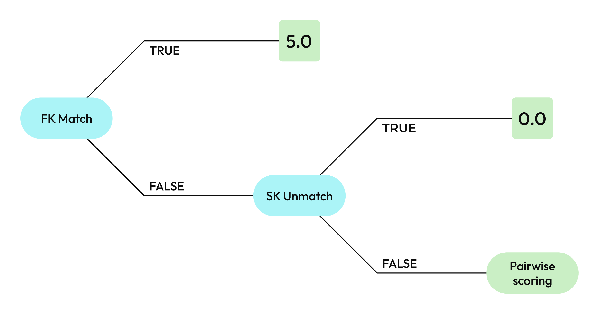

.. https://docs.amperity.com/kb/

==================================================
Foreign key matching
==================================================

.. include:: ../../amperity_operator/source/configure_stitch.rst
   :start-after: .. configure-stitch-advanced-clustering-matching-strategy-fk-start
   :end-before: .. configure-stitch-advanced-clustering-matching-strategy-fk-end

